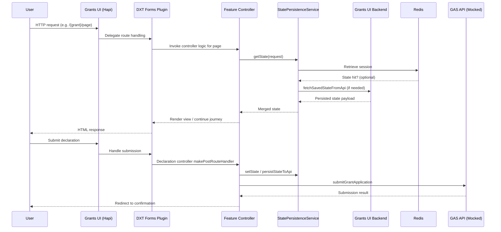
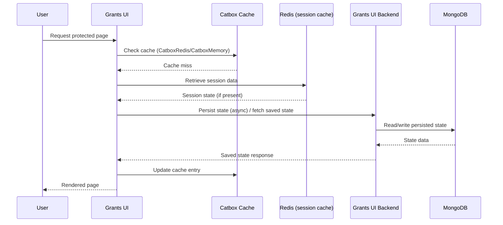
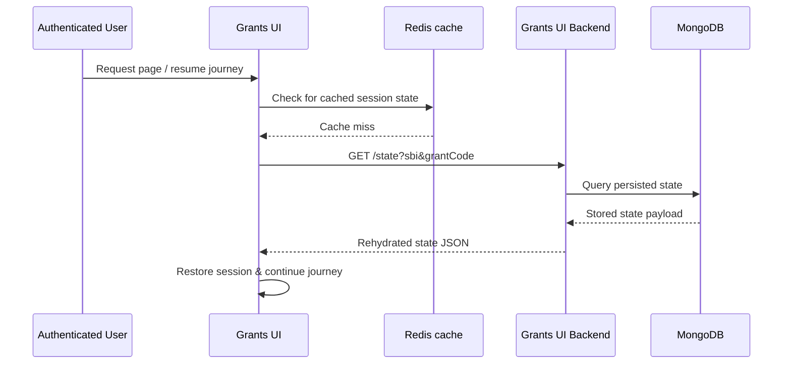
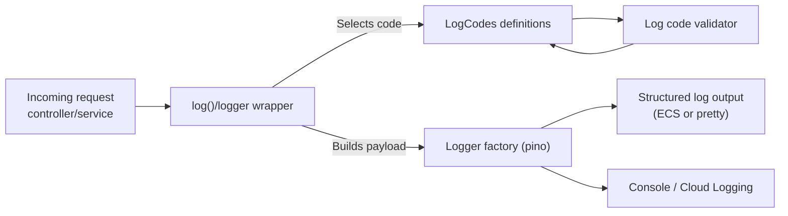

# grants-ui

[](https://sonarcloud.io/summary/new_code?id=DEFRA_grants-ui)
[](https://sonarcloud.io/summary/new_code?id=DEFRA_grants-ui)
[](https://sonarcloud.io/summary/new_code?id=DEFRA_grants-ui)

Core delivery platform Node.js Frontend Template.

- [Requirements](#requirements)
  - [Node.js](#nodejs)
- [DXT Forms Engine Plugin](#dxt-forms-engine-plugin)
- [Features](#features)
- [Tasklist System](#tasklist-system)
- [Development Tools & Configuration](#development-tools--configuration)
  - [Testing Framework](#testing-framework)
  - [Code Quality & Linting](#code-quality--linting)
  - [Authentication & Security](#authentication--security)
  - [Rate Limiting](#rate-limiting)
  - [Agreements System](#agreements-system)
  - [Custom NPM Scripts](#custom-npm-scripts)
- [Cookies](#cookies)
  - [Inspecting cookies](#inspecting-cookies)
- [Server-side Caching](#server-side-caching)
- [Session Rehydration](#session-rehydration)
- [Server to Server (S2S) Authentication](#server-to-server-s2s-authentication)
  - [Application Lock System](#application-lock-system)
- [Land Grants API Authentication](#land-grants-api-authentication)
- [Redis](#redis)
- [Proxy](#proxy)
- [Feature Structure](#feature-structure)
- [Local Development](#local-development)
  - [Setup](#setup)
  - [Development](#development)
  - [Environment variables](#environment-variables)
  - [GAS Integration](#gas-integration)
  - [Production](#production)
  - [Npm scripts](#npm-scripts)
  - [Update dependencies](#update-dependencies)
  - [Formatting](#formatting)
    - [Windows prettier issue](#windows-prettier-issue)
- [Docker](#docker)
  - [Development image](#development-image)
  - [Production image](#production-image)
  - [Docker Compose](#docker-compose)
  - [Dependabot](#dependabot)
  - [SonarCloud](#sonarcloud)
- [Structured Logging System](#structured-logging-system)
  - [Core Components](#core-components)
  - [Directory Structure](#directory-structure)
  - [Log Code Categories](#log-code-categories)
  - [Usage Examples](#usage-examples)
  - [Log Code Structure](#log-code-structure)
  - [Configuration](#configuration)
  - [Best Practices](#best-practices)
  - [Integration Points](#integration-points)
  - [Testing](#testing)
  - [Monitoring and Observability](#monitoring-and-observability)
  - [Standard Logging Approach](#standard-logging-approach)
  - [Adding New Log Codes](#adding-new-log-codes)
  - [Development Workflow](#development-workflow)
- [Development Tools](#development-tools)
- [Analytics](#analytics)
- [Licence](#licence)
  - [About the licence](#about-the-licence)

## Requirements

### Node.js

Please install [Node.js](http://nodejs.org/) `>= v24` and [npm](https://nodejs.org/) `>= v9`. You will find it
easier to use the Node Version Manager [nvm](https://github.com/creationix/nvm)

To use the correct version of Node.js for this application, via nvm:

```bash
cd grants-ui
nvm use
```

## Features

The Grants UI service provides a comprehensive set of features for building grant application forms. These features are demonstrated in the Example Grant with Auth journey and documented in detail in [FEATURES.md](./FEATURES.md).

Key features include:

- **Form Components**: 13 different input components (TextField, RadiosField, CheckboxesField, etc.)
- **Page Types**: Summary, Declaration, Confirmation, Terminal, and Conditional pages
- **Guidance Components**: Html, Details, InsetText, Markdown, and List components
- **Authentication**: Defra ID integration with whitelist support
- **Conditional Logic**: Dynamic page routing and content display
- **Validation**: Custom validation messages and schema validation
- **Configuration**: YAML-based form definitions with confirmation content

For complete documentation of all available features, see [FEATURES.md](./FEATURES.md).

## DXT Forms Engine Plugin

Grants UI uses the [DXT Forms Engine](https://github.com/DEFRA/dxt-forms-engine) to render forms.

We override the default DXT SummaryPageController which is used as a combined "check answers" and "submit" page, to provide these as separate pages.

CheckResponsesPageController renders a page showing the questions and answers the user has completed, and allows the user to change their answers.

DeclarationPageController renders a declaration page and submits the form to GAS. It does not use the `confirmationState` used by DXT and does not clear the state.
Instead it sets `applicationStatus` to `SUBMITTED` along with `submittedAt` and `submittedBy` fields.

### Forms Engine State Model

DXT Controllers pass a `context` object into every handler. Grants UI relies on two key properties:

- `context.state`: the full mutable state bag for the current journey. Grants UI stores intermediate answers, lookups, and UI scaffolding here (for example `context.state.applicantContactDetails`). Use the helper methods exposed by the base controllers—primarily `await this.setState(request, newState)` or `await this.mergeState(request, context.state, update)`—to persist changes so they flow through the cache layer (`QuestionPageController.setState`, `QuestionPageController.mergeState` in the forms engine plugin).
- `context.relevantState`: a projection produced by the forms engine that contains only the answers needed for submission. This is the source of truth used by declaration/confirmation controllers when building payloads for GAS (see `DeclarationPageController`).

StatePersistenceService persists both structures through the Grants UI Backend API (which stores data in MongoDB) so that state survives page refreshes and "save and return" flows. Redis is used separately for session caching (auth cookies, Yar session data, tasklist temp data) but not for form state persistence. When working on new controllers, prefer `context.relevantState` for data you plan to submit, and use `context.state` for auxiliary UI data. Changes to either must be serialisable because the persistence layer stores them as JSON.

Practical usage tips:

- `await this.setState(request, { ...context.state, applicantContactDetails: updated })` completely replaces the stored state for the current journey.
- `await this.mergeState(request, context.state, { applicantContactDetails: updated })` applies a shallow merge when you only need to tweak a subset of keys.
- Never mutate `context.state` in place; always go through the helpers so that the new state is flushed through the cache service and persisted for save-and-return flows.



## Tasklist System

A configurable tasklist system for multi-step workflows:

- **YAML Configuration**: Define workflow structure in YAML files
- **Conditional Logic**: Show/hide sections based on user data
- **Dependencies**: Control section availability based on completion status
- **Status Tracking**: Automatic calculation of completion status

For detailed documentation on the tasklist system, see the [Tasklist Documentation](https://github.com/DEFRA/grants-ui/tree/main/src/server/tasklist).

## Development Tools & Configuration

### Testing Framework

The application uses **Vitest** as its test framework with custom module aliases for mocking external dependencies like `@defra/forms-engine-plugin`.

#### Test Types

The test suite is organized into different categories:

- **Unit Tests**: Fast, isolated tests for individual functions and components (run with `npm run test:unit`)
- **Integration Tests**: Slower tests that verify interactions between components, external services, or the full server stack
- **Contract Tests**: Pact-based contract tests that verify API contracts with external services (run with `npm run test:contracts`)
- **Acceptance Tests**: End-to-end browser tests for complete user journeys (run with `npm run test:acceptance`)

#### Running Tests

```bash
# Run all tests with coverage (unit + integration)
npm test

# Run only unit tests (fast, excludes slow integration tests)
npm run test:unit

# Run only contract/Pact tests
npm run test:contracts

# Run acceptance tests
npm run test:acceptance

# Run tests in watch mode during development
npm run test:watch
```

#### Test Configuration

- `vitest.config.js` - Main configuration for all tests
- `vitest.unit.config.js` - Configuration for unit tests only (excludes integration tests)

Integration tests are identified by:

- `**/*.contract.test.js` - Pact contract tests
- Tests that start the full Hapi server (e.g., `start-server.test.js`)
- Tests making real external service calls (e.g., `grant-application.service.test.js`)

#### Mutation Testing

The project uses **Stryker Mutator** to assess test quality by introducing mutations (small code changes) and verifying that tests catch them.

**Running Mutation Tests:**

```bash
# Run Stryker mutation testing
npx stryker run

# View the mutation report
open reports/mutation/mutation.html
```

**Configuration:**

- `stryker.config.mjs` - Main Stryker configuration
- `testRunner: 'command'` - Uses the custom test command defined in `commandRunner`
- `commandRunner.command: 'npm run test:stryker'` - Runs tests for mutation testing
- Reports are generated in `reports/mutation/` directory

**What Mutation Testing Does:**

Stryker creates modified versions of your code (mutants) by:

- Changing operators (`===` to `!==`, `&&` to `||`)
- Modifying conditionals (`>` to `>=`, `<` to `<=`)
- Removing optional chaining (`?.`)
- Altering return values

Each mutant is tested against your test suite. If tests fail, the mutant is "killed" (good). If tests pass, the mutant "survived" (indicates weak test coverage).

**Mutation Score:**

The mutation score indicates test effectiveness:

- **100%**: All mutants killed - excellent test quality
- **80-99%**: Most mutants killed - good test quality
- **60-79%**: Some mutants survived - tests need improvement
- **<60%**: Many mutants survived - significant test gaps

**Best Practices:**

- Run mutation tests on specific files or modules rather than the entire codebase (faster feedback)
- Focus on critical business logic and complex conditionals
- Use mutation reports to identify untested edge cases
- Mutation testing complements (not replaces) code coverage metrics

### Code Quality & Linting

- **Neostandard**: Modern JavaScript/Node.js linting configuration that provides opinionated code quality rules
- **TSX**: Modern Node.js runtime used for development server (better ES module support)

### Authentication & Security

- **Defra ID Integration**: Primary authentication service using OpenID Connect (OIDC) protocol
  - For detailed environment variable configuration, see [DEFRA ID Integration](#defra-id-integration)
- **Whitelist System**: CRN (Customer Reference Number) and SBI (Single Business Identifier) whitelisting for specific grants:
  - `EXAMPLE_WHITELIST_CRNS`: Authorized CRNs for Example Grant journeys (used by the Example Whitelist form definition)
  - `EXAMPLE_WHITELIST_SBIS`: Authorized SBIs for Example Grant journeys (used by the Example Whitelist form definition)
  - For complete whitelist configuration, see [Feature Flags & Misc](#feature-flags--misc)

### Whitelist Functionality

Whitelisting restricts access to specific grant journeys based on Customer Reference Numbers (CRNs) and Single Business Identifiers (SBIs). Forms that require whitelisting declare the relevant environment variables in their YAML definition (see [`src/server/common/forms/definitions/example-whitelist.yaml`](./src/server/common/forms/definitions/example-whitelist.yaml)). At runtime, the whitelist service (`src/server/auth/services/whitelist.service.js`) reads the configured environment variables, normalises the values, and validates incoming CRN/SBI credentials. If a user's identifiers are not present in the configured whitelist, the journey is terminated and the user is shown a terminal page.

### Rate Limiting

The application implements rate limiting to protect against abuse and denial-of-service attacks (CWE-400: Uncontrolled Resource Consumption). Rate limiting is implemented using [hapi-rate-limit](https://github.com/wraithgar/hapi-rate-limit).

#### How It Works

- **Per-user limiting**: Limits requests per IP address within a configurable time window
- **Per-path limiting**: Limits total requests to specific endpoints
- **Auth endpoint protection**: Stricter limits on authentication endpoints to prevent brute-force attacks
- **IP extraction**: Correctly extracts client IP from `X-Forwarded-For` header when behind proxies/load balancers
- **Monitoring**: Logs rate limit violations with IP, path, user ID, and user agent for security monitoring

#### Configuration

Rate limiting is controlled via environment variables:

| Variable                              | Description                                      | Default                  |
| ------------------------------------- | ------------------------------------------------ | ------------------------ |
| `RATE_LIMIT_ENABLED`                  | Enable/disable rate limiting                     | `true` (production only) |
| `RATE_LIMIT_TRUST_PROXY`              | Trust X-Forwarded-For header                     | `true`                   |
| `RATE_LIMIT_USER_LIMIT`               | Max requests per user (IP) per period            | `100`                    |
| `RATE_LIMIT_USER_LIMIT_PERIOD`        | Time window in milliseconds                      | `60000` (1 minute)       |
| `RATE_LIMIT_PATH_LIMIT`               | Max requests per path per period                 | `2000`                   |
| `RATE_LIMIT_AUTH_LIMIT`               | Max requests requiring authentication per period | `5`                      |
| `RATE_LIMIT_AUTH_ENDPOINT_USER_LIMIT` | Max requests per user to auth endpoints          | `10`                     |
| `RATE_LIMIT_AUTH_ENDPOINT_PATH_LIMIT` | Max requests per auth endpoint path              | `500`                    |

#### Protected Endpoints

The following authentication endpoints have stricter rate limits (`authEndpointUserLimit` / `authEndpointPathLimit`) applied:

| Endpoint              | Method | Purpose                |
| --------------------- | ------ | ---------------------- |
| `/auth/sign-in`       | GET    | Sign-in initiation     |
| `/auth/sign-in-oidc`  | GET    | OIDC callback          |
| `/auth/sign-out`      | GET    | Sign-out               |
| `/auth/sign-out-oidc` | GET    | OIDC sign-out callback |

All other endpoints use the global rate limits (`userLimit` / `pathLimit`).

#### Response Headers

When rate limiting is enabled, responses include headers indicating limit status:

- `X-RateLimit-Limit`: Maximum requests allowed
- `X-RateLimit-Remaining`: Requests remaining in current window
- `X-RateLimit-Reset`: Time when the limit resets (Unix timestamp)

#### Rate Limit Exceeded

When a client exceeds the rate limit:

1. A `429 Too Many Requests` response is returned
2. The event is logged with client details for monitoring:
   ```
   [warn] Rate limit exceeded: path=/auth/sign-in, ip=192.168.1.100, userId=user123, userAgent=Mozilla/5.0...
   ```
3. A user-friendly error page is displayed

#### Development Mode

Rate limiting is **disabled by default** in non-production environments to avoid friction during local development. To test rate limiting locally, set:

```bash
RATE_LIMIT_ENABLED=true
```

### Agreements System

The application includes a proxy endpoint for handling farming payment agreements, which forwards requests to an external agreements service.

**How It Works:**

The agreements controller acts as an authenticated proxy that:

- Accepts requests at `/agreements/{path*}`
- Extracts SBI (Single Business Identifier) from Defra ID credentials
- Generates a JWT token with SBI and source information
- Forwards requests to the external agreements service with authentication headers

**Configuration:**

| Variable                | Description                                  | Required |
| ----------------------- | -------------------------------------------- | -------- |
| `AGREEMENTS_UI_TOKEN`   | Bearer token for authenticating with the API | Yes      |
| `AGREEMENTS_UI_URL`     | Base URL of the agreements service           | Yes      |
| `AGREEMENTS_BASE_URL`   | Base path for agreements routes in grants-ui | Yes      |
| `AGREEMENTS_JWT_SECRET` | Secret key for signing JWT tokens            | Yes      |

**Example Configuration:**

```bash
AGREEMENTS_UI_TOKEN=your-bearer-token
AGREEMENTS_UI_URL=https://agreements-service.example.com
AGREEMENTS_BASE_URL=/agreement
AGREEMENTS_JWT_SECRET=your-jwt-secret
```

**Security:**

- Requires authenticated session (Defra ID)
- Uses JWT encryption for sensitive data transmission
- Validates configuration at startup

**Implementation:**

See `src/server/agreements/controller.js` for the proxy implementation.

### Development Services Integration (docker compose)

- **Grants UI Backend**: Separate Node.js service (`defradigital/grants-ui-backend`) for data persistence
- **MongoDB**: Document database used by the backend service for storing application data
- **FFC Grants Scoring**: External scoring service (`defradigital/ffc-grants-scoring`) for grant evaluation
- **MockServer**: API mocking service for development and testing with predefined expectations
- **Defra ID Stub**: Local OpenID Connect provider used to mimic Defra ID authentication flows
- **GAS API (Mocked)**: Grants Application Service endpoint stubbed by MockServer for submissions and confirmation flows

```mermaid
graph TD
  User[Browser / User] -->|HTTP :3000| UI[Grants UI]
  UI -->|Session data| Redis[(Redis)]
  UI -->|State API| Backend[Grants UI Backend]
  Backend -->|Persist/Fetch| Mongo[(MongoDB)]
  UI -->|Scoring request| Scoring[FFC Grants Scoring]
  UI -->|Grant submission| GAS[MockServer (GAS API)]
  UI -.->|OIDC flows| DefraID[Defra ID Stub]
```

For complete service configuration and setup, see [Docker Compose](#docker-compose) section.

### Custom NPM Scripts

Beyond the standard scripts, the application includes contract testing via `npm run test:contracts` using Vitest.

## Cookies

We use the `@hapi/cookie` plugin to manage user sessions and `@hapi/yar` to manage cache. The session cookie is encrypted and signed using a high-entropy password set via the `SESSION_COOKIE_PASSWORD` environment variable.

The table below outlines the data the cookies control.

<table>
  <thead>
    <tr>
      <th>Cookie Name</th>
      <th>YAR managed</th>
      <th>Cache name</th>
      <th>Segment</th>
    </tr>
  </thead>
  <tbody>
    <tr>
      <td>grants-ui-session-auth</td>
      <td>No</td>
      <td>session-auth</td>
      <td>auth</td>
    </tr>
    <tr>
      <td rowspan="3">grants-ui-session-cache</td>
      <td>No</td>
      <td rowspan="3">session-cache</td>
      <td>tasklist-section-data</td>
    </tr>
    <tr>
      <td rowspan="2">Yes</td>
      <td>state</td>
    </tr>
    <tr>
      <td>formSubmission</td>
    </tr>
  </tbody>
</table>

### Inspecting cookies

There is a tool provided `tools/unseal-cookie.js` that will decode and decrypt the cookies for inspection on the command line. You will need the appropriate cookie password.
To use the tool:

```bash
// With node directly
node ./tools/unseal-cookie.js '<cookie-string>' '<cookie-password>'

// With the NPM script
npm run unseal:cookie -- '<cookie-string>' '<cookie-password>'
```

## Server-side Caching

We use Catbox for server-side caching. By default the service will use CatboxRedis when deployed and CatboxMemory for
local development.
You can override the default behaviour by setting the `SESSION_CACHE_ENGINE` environment variable to either `redis` or
`memory`.

Please note: CatboxMemory (`memory`) is _not_ suitable for production use! The cache will not be shared between each
instance of the service and it will not persist between restarts.



## Session Rehydration

The application includes session rehydration functionality that allows user sessions to be restored from a backend API. This is particularly useful for maintaining user state across different services.

### How Session Rehydration Works

The application fetches saved state from the backend API using the endpoint configured in `GRANTS_UI_BACKEND_URL`.
When a user is authenticated, the service:

- Checks for existing cache
- If there is none, fetches data from the Grants UI Backend service (which persists data to Mongo)
- Performs session rehydration



### Configuration

Session rehydration is controlled by the following environment variables:

- `GRANTS_UI_BACKEND_URL`: The Grants UI Backend service endpoint used for state persistence
- `GRANTS_UI_BACKEND_AUTH_TOKEN`: Bearer token used to authenticate requests to the backend
- `GRANTS_UI_BACKEND_ENCRYPTION_KEY`: Encryption key used to secure the backend bearer token

### Error Handling

If session rehydration fails (e.g., backend unavailable, network issues), the application will:

- Log the error for debugging
- Continue normal operation without restored state
- Allow the user to proceed with a fresh session

## Server-to-Server (S2S) Authentication

When making API requests to backend services, our helpers handle the necessary authentication and headers. This ensures secure communication without requiring manual token management.

### Authorization Headers

The primary helper is:

```js
import { createApiHeadersForGrantsUiBackend } from '~/src/server/common/helpers/state/backend-auth-helper.js'
```

It generates headers that include:

- Content-Type: application/json
- Authorization: Bearer <encrypted-token> (if a token is configured)
- Optional additional headers

Example Usage

```js
const headers = createApiHeadersForGrantsUiBackend()
```

If a token is configured in the environment (`session.cache.authToken`), the helper automatically:

Encrypts the token using AES-256-GCM with the configured encryption key (session.cache.encryptionKey).

- Base64 encodes the encrypted token.
- Adds the Authorization header:

```js
Authorization: Bearer <base64-encrypted-token>
```

The helper preserves any custom base headers you pass:

```js
const headers = createApiHeadersForGrantsUiBackend({
  'User-Agent': 'my-service',
  'X-Custom-Header': 'value'
})
```

### Optional Lock Token

For operations that require a concurrency lock, you can pass an optional `lockToken`:

```js
const headers = createApiHeadersForGrantsUiBackend({ lockToken: 'LOCK-123' })
```

This adds an additional header:

```js
X-Application-Lock-Owner: LOCK-123
```

without affecting the Authorization header or any base headers.

### Application Lock System

The application implements a distributed lock mechanism to prevent concurrent modifications to the same application by multiple users or sessions.

#### How It Works

When a user accesses an application for editing:

1. A lock token is generated using JWT and the configured secret
2. The token is sent to the backend service with requests
3. The backend service validates the token and ensures only the lock holder can modify the application
4. Locks automatically expire after the configured TTL

#### Configuration

| Variable                        | Description                        | Default           |
| ------------------------------- | ---------------------------------- | ----------------- |
| `APPLICATION_LOCK_TOKEN_SECRET` | Secret key for signing lock tokens | (required)        |
| `APPLICATION_LOCK_TTL_MS`       | Lock time-to-live in milliseconds  | `14400000` (4hrs) |

**Note:** The same secret must be configured in both grants-ui and grants-ui-backend services.

#### Lock Headers

When operations require a lock, requests include:

```
X-Application-Lock-Owner: <JWT-token>
```

This header is automatically added by the `createApiHeadersForGrantsUiBackend` helper when a `lockToken` parameter is provided.

### Base Headers Only

If no token is configured, the helper returns only the base headers:

```js
{
  'Content-Type': 'application/json',
  'User-Agent': 'my-service'
}
```

## Land Grants Api Authentication

The application now supports **server-to-server (S2S) authentication** when communicating with the **Land Grants API**.

When any request is made to the Land Grants API (e.g., `/payments/calculate`, `/parcels`), the system automatically includes an encrypted Bearer token in the `Authorization` header. This ensures secure, authenticated communication between services.

### How it works

1. The helper reads the following environment variables:
   - `LAND_GRANTS_API_AUTH_TOKEN` — static bearer token used for authentication.
   - `LAND_GRANTS_API_ENCRYPTION_KEY` — symmetric key used to encrypt the token.

2. The token is encrypted using **AES-256-GCM** before transmission.

3. The resulting value is encoded and set as the Bearer token in the `Authorization` header.

4. API clients like `land-grants.client.js` automatically include these headers in every request using:

   ```javascript
   import { createApiHeadersForLandGrantsBackend } from '~/src/server/common/helpers/state/backend-auth-helper.js'

   const response = await fetch(`${baseUrl}/payments/calculate`, {
     method: 'POST',
     headers: createApiHeadersForLandGrantsBackend(),
     body: JSON.stringify(payload)
   })
   ```

### Example Authorization Header

```
Authorization: Bearer <base64-encoded-encrypted-token>
Content-Type: application/json
```

### Environment Variables

| Variable                         | Description                                               |
| -------------------------------- | --------------------------------------------------------- |
| `LAND_GRANTS_API_AUTH_TOKEN`     | Bearer token used to authenticate to the Land Grants API. |
| `LAND_GRANTS_API_ENCRYPTION_KEY` | Key used to encrypt the auth token before transmission.   |

This mechanism provides a secure, environment-driven way to authenticate backend-to-backend requests without exposing plain-text tokens in configuration or logs.

## Redis

Redis is an in-memory key-value store. Every instance of a service has access to the same Redis key-value store similar
to how services might have a database (or MongoDB). All frontend services are given access to a namespaced prefixed that
matches the service name. e.g. `my-service` will have access to everything in Redis that is prefixed with `my-service`.

If your service does not require a session cache to be shared between instances or if you don't require Redis, you can
use the in-memory cache by setting `SESSION_CACHE_ENGINE=memory` or changing the default value in `~/src/config/config.js`.

## Proxy

A forward-proxy can be enabled by setting the `HTTP_PROXY` environment variable. When present, `setGlobalDispatcher(new ProxyAgent(proxyUrl))` is invoked automatically so calls made with `fetch` from `undici` use the proxy.

If you are not using Wreck, Axios or Undici or a similar http that uses `Request`. Then you may have to provide the proxy dispatcher:

To add the dispatcher to your own client:

```javascript
import { ProxyAgent } from 'undici'

return await fetch(url, {
  dispatcher: new ProxyAgent({
    uri: proxyUrl,
    keepAliveTimeout: 10,
    keepAliveMaxTimeout: 10
  })
})
```

## Feature Structure

The repository has been structured to follow a feature-based structure, where each feature is organized into its own directory with all related components (controllers, views, tests, and utilities).

### Feature Organization

Each feature follows a consistent structure:

```
src/server/{feature-name}/
├── {feature-name}.controller.js          # Main controller logic
├── {feature-name}.controller.test.js     # Controller tests
├── views/                                # Feature-specific views/templates
│   └── {feature-page}.html/.njk
├── index.js                              # Feature entry point (if needed)
└── {additional-utilities}.js             # Feature-specific utilities
```

#### Optional Subfolder Organization

For more complex features, additional subfolders can be used to further organize the code:

```
src/server/{feature-name}/
├── controllers/                          # Multiple controllers for different pages
│   ├── page1.controller.js
│   ├── page1.controller.test.js
│   ├── page2.controller.js
│   └── page2.controller.test.js
├── services/                             # Business logic and external service calls
│   ├── {feature-name}.service.js
│   └── {feature-name}.service.test.js
├── mappers/                              # Data transformation utilities
│   ├── state-to-gas-answers-mapper.js
│   └── state-to-gas-answers-mapper.test.js
├── utils/                                # Feature-specific utility functions
│   ├── format-phone.js
│   └── format-phone.test.js
├── views/                                # Feature-specific views/templates
│   └── {feature-page}.html/.njk
└── index.js                              # Feature entry point
```

This subfolder approach is particularly useful for features with multiple pages, complex business logic, or extensive data transformation requirements.

### Benefits of Feature-Based Structure

- **Co-location**: Related files are grouped together, making it easier to find and modify feature-specific code
- **Maintainability**: Clear separation of concerns with each feature self-contained
- **Scalability**: New features can be added following the same pattern
- **Testing**: Feature-specific tests are located alongside the code they test
- **Navigation**: Developers can quickly understand the structure and locate relevant files

## Local Development

### Setup

Install application dependencies:

```bash
npm install
```

### Development

To run the application in `development` mode run:

```bash
npm run dev
```

Or see the [docker compose setup](#docker-compose) below.

### Environment variables

Below is a list of required environment variables to configure and run the Grants UI application locally or in an environment (e.g., Dev, Test, Perf Test, Prod).

#### DEFRA ID Integration

These are required only if DEFRA ID authentication is enabled, and you are using either the FCP Defra ID Stub or connecting to Defra ID in the `development` environment:

| Variable                         | Description                                                                              |
| -------------------------------- | ---------------------------------------------------------------------------------------- |
| `DEFRA_ID_WELL_KNOWN_URL`        | The OIDC discovery URL used by DEFRA ID (must be reachable at startup).                  |
| `DEFRA_ID_CLIENT_ID`             | Provided by DEFRA ID — used to identify the app.                                         |
| `DEFRA_ID_CLIENT_SECRET`         | Secret from DEFRA ID — **must be kept confidential**.                                    |
| `DEFRA_ID_SERVICE_ID`            | Used by DEFRA ID to display your service name on the login screen.                       |
| `DEFRA_ID_REDIRECT_URL`          | URL DEFRA ID redirects to after login. **Must match exactly what DEFRA ID has on file.** |
| `DEFRA_ID_SIGN_OUT_REDIRECT_URL` | Redirect after logout. Same note as above.                                               |

#### Session and Cookie security

| Variable                  | Description                                                    | Default |
| ------------------------- | -------------------------------------------------------------- | ------- |
| `SESSION_COOKIE_PASSWORD` | High-entropy password (e.g., 32+ chars) for cookie encryption. |
| `SESSION_COOKIE_TTL`      | Cookie duration in milliseconds.                               |
| `SESSION_TIMEOUT`         | Inactivity timeout before logout.                              |
| `SESSION_CACHE_TTL`       | TTL for session data in the cache.                             |
| `SESSION_CACHE_ENGINE`    | Session store engine — `memory` or `redis`.                    |

#### Application URLs

| Variable                | Description                                    |
| ----------------------- | ---------------------------------------------- |
| `APP_BASE_URL`          | Base URL of the Grants UI app.                 |
| `GRANTS_UI_BACKEND_URL` | Local or remote backend endpoint.              |
| `GAS_API_URL`           | Endpoint for Grants Application Service (GAS). |
| `MANAGER_URL`           | Used for internal routing or redirects.        |
| `DESIGNER_URL`          | Form designer UI base URL.                     |
| `SUBMISSION_URL`        | Backend submission URL (Docker-safe format).   |
| `UPLOADER_URL`          | File uploader service endpoint.                |
| `UPLOADER_BUCKET_NAME`  | Name of the S3 or storage bucket.              |

#### GAS API

| Variable             | Description                                |
| -------------------- | ------------------------------------------ |
| `GAS_API_AUTH_TOKEN` | Service to service auth token for GAS API. |

Note: The token is a **SECRET** and needs to be generated using a script in the GAS API repo and
a hash stored in the GAS MongoDB. This env var should be the raw token value,
which is formatted as a GUID string.

#### GOV.UK Notify

| Variable             | Description                                           |
| -------------------- | ----------------------------------------------------- |
| `NOTIFY_TEMPLATE_ID` | ID of the Notify template used for user-facing comms. |
| `NOTIFY_API_KEY`     | GOV.UK Notify API key — **treat as a secret**.        |

#### Redis Configuration

| Variable                    | Description                                          | Default                        |
| --------------------------- | ---------------------------------------------------- | ------------------------------ |
| `REDIS_HOST`                | Redis host (e.g., `localhost` or Docker)             | `127.0.0.1`                    |
| `REDIS_USERNAME`            | Username for Redis, if using ACL.                    | (empty)                        |
| `REDIS_PASSWORD`            | Password for Redis connection.                       | (empty)                        |
| `REDIS_KEY_PREFIX`          | Prefix for all Redis keys used.                      | `grants-ui:`                   |
| `USE_SINGLE_INSTANCE_CACHE` | Connect to single Redis instance instead of cluster. | `true` in dev, `false` in prod |
| `REDIS_TLS`                 | Connect to Redis using TLS.                          | `true` in production           |
| `REDIS_CONNECT_TIMEOUT`     | Redis connection timeout in milliseconds.            | `30000`                        |
| `REDIS_RETRY_DELAY`         | Redis retry delay in milliseconds.                   | `1000`                         |
| `REDIS_MAX_RETRIES`         | Redis max retries per request.                       | `10`                           |

#### Feature Flags & Misc

| Variable        | Description                                 |
| --------------- | ------------------------------------------- |
| `FEEDBACK_LINK` | URL to feedback (e.g., GitHub issue, form). |

#### Additional Configuration

| Variable                     | Description                                    | Default                     |
| ---------------------------- | ---------------------------------------------- | --------------------------- |
| `SERVICE_VERSION`            | Service version (injected in CDP environments) | null                        |
| `ENVIRONMENT`                | CDP environment name                           | `local`                     |
| `SERVICE_NAME`               | Application service name                       | `Manage land-based actions` |
| `STATIC_CACHE_TIMEOUT`       | Static asset cache timeout in milliseconds     | `604800000` (1 week)        |
| `ASSET_PATH`                 | Path to static assets                          | `/public`                   |
| `TRACING_HEADER`             | HTTP header for distributed tracing            | `x-cdp-request-id`          |
| `GA_TRACKING_ID`             | Google Analytics tracking ID (optional)        | undefined                   |
| `COOKIE_POLICY_URL`          | URL for cookie policy page                     | `/cookies`                  |
| `COOKIE_CONSENT_EXPIRY_DAYS` | Days before cookie consent expires             | `365`                       |
| `DEV_TOOLS_ENABLED`          | Enable development tools and routes            | `true` (dev only)           |

#### Defra ID Additional Settings

| Variable                  | Description                        | Default |
| ------------------------- | ---------------------------------- | ------- |
| `DEFRA_ID_REFRESH_TOKENS` | Enable token refresh functionality | `true`  |

#### Land Grants Configuration

| Variable                         | Description                              |
| -------------------------------- | ---------------------------------------- |
| `GAS_FRPS_GRANT_CODE`            | Grant code for Future RPS in GAS         |
| `LAND_GRANTS_API_URL`            | Land Grants API endpoint                 |
| `LAND_GRANTS_API_AUTH_TOKEN`     | Auth token for Land Grants API           |
| `LAND_GRANTS_API_ENCRYPTION_KEY` | Encryption key for Land Grants API token |

**Note:** For detailed Land Grants API authentication, see [Land Grants API Authentication](#land-grants-api-authentication).

#### Consolidated View API (Optional)

| Variable              | Description                           |
| --------------------- | ------------------------------------- |
| `CV_API_ENDPOINT`     | Consolidated View API endpoint        |
| `CV_API_MOCK_ENABLED` | Enable mock DAL for Consolidated View |

#### Microsoft Entra (Internal Use)

| Variable                       | Description                    |
| ------------------------------ | ------------------------------ |
| `ENTRA_INTERNAL_TOKEN_URL`     | Microsoft Entra token endpoint |
| `ENTRA_INTERNAL_TENANT_ID`     | Microsoft tenant ID            |
| `ENTRA_INTERNAL_CLIENT_ID`     | Microsoft client ID            |
| `ENTRA_INTERNAL_CLIENT_SECRET` | Microsoft client secret        |

#### Development Tools Configuration

When `DEV_TOOLS_ENABLED=true`, the following demo data can be configured. See [Development Tools](#development-tools) for more details:

| Variable                 | Description           | Default              |
| ------------------------ | --------------------- | -------------------- |
| `DEV_DEMO_REF_NUMBER`    | Demo reference number | `DEV2024001`         |
| `DEV_DEMO_BUSINESS_NAME` | Demo business name    | `Demo Test Farm Ltd` |
| `DEV_DEMO_SBI`           | Demo SBI number       | `999888777`          |
| `DEV_DEMO_CONTACT_NAME`  | Demo contact name     | `Demo Test User`     |

### Grant Form Definitions

Grant form definitions are stored in the `src/server/common/forms/definitions` directory as YAML files and read at startup.

Forms will not be enabled in production unless the YAML file contains the `enabledInProd: true` property.

Any changes to these files will require a restart of the application.

### GAS Integration

The Grants Application Service (GAS) is used to store grant definitions that the app submits data against.

Creating a Grant Definition
A grant definition is created via the GAS backend by making a POST request to the /grants endpoint (see postman folder in the root of the project). This defines the structure and schema of the grant application payload, which the app will later submit.

You can also create a grant using the [GAS API](https://github.com/DEFRA/fg-gas-backend). For API documentation and examples, see the [fg-gas-backend repository](https://github.com/DEFRA/fg-gas-backend).

Example request (truncated - see [GAS API documentation](https://github.com/DEFRA/fg-gas-backend) for full schema):

```bash
curl --location --request POST 'https://fg-gas-backend.dev.cdp-int.defra.cloud/grants' \
--header 'Content-Type: application/json' \
--data-raw '{
  "code": "adding-value-v4",
  "questions": {
    "$schema": "https://json-schema.org/draft/2020-12/schema",
    "title": "GrantApplicationPayload",
    "type": "object",
    "properties": {
      "referenceNumber": { "type": "string" },
      "businessNature": { "type": "string" },
      "businessLegalStatus": { "type": "string" },
      "isInEngland": { "type": "boolean" },
      // ... additional fields as required
    }
  }
}'
```

Example response:

```
{
    "code": "adding-value-v4"
}
```

#### Submission Schema Validators

Each GAS grant may define a JSON Schema stored locally in:

`src/server/common/forms/schemas/`

Each schema file is named after the grant code
(e.g. adding-value-v4.json) and describes the shape of the expected application payload for that grant.

At application startup, the app scans the schemas directory and compiles each schema into a JSON Schema validator using Ajv. These compiled validators are stored in-memory in a map of the form:

`Map<string, ValidateFunction>`

##### ❗ Current Runtime Behaviour

Although the validators are compiled at startup, they are not currently used at runtime to validate submissions within the grants-ui submission pipeline.

The helper:

`validateSubmissionAnswers(payload, grantCode)`

is currently used only in tests to ensure that the mapping logic produces payloads that conform to the expected schema format.

#### Using the `gas.http` helper and HTTP client environments

For local development and manual testing of grant definitions and submissions against GAS, this repository includes:

- `gas.http` – an HTTP client collection with example requests for:
  - creating grant definitions in GAS for `example-grant-with-auth` and `adding-value`
  - submitting example applications for those grants
- `http-client.env.json` – shared, non‑secret environment configuration (base URLs)
- `http-client.private.env.json` – per‑environment secrets (service tokens and API keys)

Most IDEs (including JetBrains IDEs and VS Code with the REST Client extension) can execute the requests in `gas.http` using these environment files.

##### `http-client.env.json` (public envs)

The `http-client.env.json` file defines the non‑secret per‑environment configuration used by `gas.http`:

```json
{
  "local": {
    "base": "http://localhost:3000"
  },
  "dev": {
    "base": "https://ephemeral-protected.api.dev.cdp-int.defra.cloud/fg-gas-backend"
  },
  "test": {
    "base": "https://ephemeral-protected.api.test.cdp-int.defra.cloud/fg-gas-backend"
  },
  "perf-test": {
    "base": "https://ephemeral-protected.api.perf-test.cdp-int.defra.cloud/fg-gas-backend"
  }
}
```

You can safely commit this file to version control as it contains no secrets.

##### `http-client.private.env.json` (secrets – do not commit)

The `http-client.private.env.json` file contains per‑environment secrets required by the `gas.http` requests and **must not** be committed. Ensure it is listed in `.gitignore`.

Create this file locally using the following template:

```json
{
  "local": {
    "serviceToken": "<local-service-token>",
    "x-api-key": "local"
  },
  "dev": {
    "serviceToken": "<dev-service-token>",
    "x-api-key": "<dev-x-api-key>"
  }
}
```

Populate the placeholders as follows (do **not** paste real secrets into the repo):

- `x-api-key` – obtain this per‑environment value from the CDP portal user profile page:
  - `https://portal.cdp-int.defra.cloud/user-profile`
- `serviceToken` – a GAS service token which must be minted and configured in GAS for each environment:
  - generate the token using the GAS tooling
  - register it in GAS (for example by adding it to the appropriate collection in GAS MongoDB)
  - use the raw token value here

Once `http-client.private.env.json` is created and populated, you can:

1. Select the desired environment (e.g. `local` or `dev`, etc) in your HTTP client.
2. Use the `Create ...` requests in `gas.http` to define grants in GAS.
3. Use the corresponding `Submit application ...` requests to send example application payloads and verify end‑to‑end integration.

#### Grant Schema Updates

In order to update a grant schema, see the [GAS API repository](https://github.com/DEFRA/fg-gas-backend) for documentation and examples.

Find the endpoint `GET /grants/{code}`, pass in the code, e.g. `frps-private-beta`, will return the grant.

When changes have been made to the schema, use the endpoint `PUT /tmp/grants/{code}` to update the grant schema.

In order to test if your schema change has worked, send through an application, and view the case tool, to see if your new data exists in the case:

https://fg-cw-frontend.dev.cdp-int.defra.cloud/cases

From here you can find the `caseId`, use the below swagger to query the `GET /cases/{caseId}`

https://fg-cw-backend.dev.cdp-int.defra.cloud/documentation#/

### Production

To mimic the application running in `production` mode locally run:

```bash
npm start
```

### Npm scripts

All available Npm scripts can be seen in [package.json](./package.json)
To view them in your command line run:

```bash
npm run
```

#### Available Scripts

- **`build`** - Orchestrates the full build process (frontend then server)
- **`build:frontend`** - Compiles client-side assets using Webpack
- **`build:server`** - Transpiles server code using Babel to the `.server` directory
- **`dev`** - Runs both frontend and server in watch mode for local development
- **`dev:debug`** - Runs development environment with Node inspector enabled
- **`docker:up`** / **`docker:down`** - Manage the standard Docker Compose stack
- **`docker:reset`** - Tear down Docker environment including volumes and local images
- **`docker:rebuild`** - Trigger a fresh build of Docker images
- **`docker:debug`** - Run the UI in a one-off Docker container with debugger ports exposed
- **`docker:ha:up`** / **`docker:ha:down`** - Manage a high-availability stack with scaled services and Nginx proxy
- **`docker:landgrants:up`** / **`docker:landgrants:ha:up`** - Manage stacks that include the Land Grants API and Postgres
- **`format`** / **`format:check`** - Format code or check formatting using Prettier
- **`lint`** - Run all linting checks (JavaScript, SCSS, and TypeScript types)
- **`lint:fix`** - Automatically fix ESLint issues
- **`test`** - Run all tests with Vitest and generate coverage reports
- **`test:unit`** - Run unit tests only (isolated from integration/contracts)
- **`test:contracts`** - Run Pact contract tests
- **`test:acceptance`** - Execute end-to-end journey tests via shell script
- **`test:watch`** - Run Vitest in interactive watch mode
- **`test:stryker`** - Run Vitest specifically for Stryker mutation testing
- **`start`** - Start the production server (requires `npm run build` first)
- **`snyk-test`** / **`snyk-monitor`** - Run security vulnerability scans
- **`unseal:cookie`** - Utility to decrypt and inspect session cookies

### Update dependencies

To update dependencies use [npm-check-updates](https://github.com/raineorshine/npm-check-updates):

> The following script is a good start. Check out all the options on
> the [npm-check-updates](https://github.com/raineorshine/npm-check-updates)

```bash
ncu --interactive --format group
```

### Formatting

#### Windows prettier issue

If you are having issues with formatting of line breaks on Windows update your global git config by running:

```bash
git config --global core.autocrlf false
```

### Authorise Snyk

Run `snyk auth` to authenticate your local machine with Snyk.

### Dependabot

We have added an example dependabot configuration file to the repository. You can enable it by renaming
the [.github/example.dependabot.yml](.github/example.dependabot.yml) to `.github/dependabot.yml`

### SonarCloud

Instructions for setting up SonarCloud can be found in [sonar-project.properties](./sonar-project.properties).

## Docker

### Development image

Build:

```bash
docker build --target development --no-cache --tag grants-ui:development .
```

Run:

```bash
docker run -p 3000:3000 grants-ui:development
```

### Production image

Build:

```bash
docker build --no-cache --tag grants-ui .
```

Run:

```bash
docker run -p 3000:3000 grants-ui
```

### Docker Compose

A local environment with:

- Redis
- MongoDB
- FCP Defra ID Stub
- This service
- Grants UI Backend
- MockServer, providing a stub for [fg-gas-backend](http://github.com/DEFRA/fg-gas-backend)

```bash
npm run docker:up
```

And optionally:

- Land Grants API and Postgres via `compose.land-grants.yml`

```bash
npm run docker:landgrants:up
```

Note: The Land Grants Postgres image contains preseeded data that enables immediate local development and testing
and is kept up-to-date automatically with changes to the [land-grants-api](http://github.com/DEFRA/land-grants-api) repo.

If you require local data or newer data not yet merged, you can use the compose scripts in the [land-grants-api](http://github.com/DEFRA/land-grants-api) repository to seed the database.

Once that repository is cloned locally, `compose.migrations.yml` provides `database-up` and `database-down` services to run migrations against the Postgres database.

Convenient npm scripts have been added in that repository for this workflow:

```bash
# Apply migrations to the grants-ui database
npm run docker:migrate:ext:up

# Roll back all migrations to the base tag v0.0.0
npm run docker:migrate:ext:down
```

#### High-availability (HA) local proxy

For local testing behind HTTPS and to simulate an HA entry point, there is an optional Nginx reverse proxy defined in `compose.ha.yml`.

What it provides:

- Scalability of `grants-ui` and `grants-ui-backend` using `docker compose --scale`
- TLS termination using the self-signed certs in `nginx/certs`
- A single HTTPS entry point for the UI at `https://localhost:4000`
- HTTPS access to the DEFRA ID Stub at `https://localhost:4007`
- Environment overrides so the UI talks to the proxy over HTTPS (see `compose.ha.yml` and `nginx/nginx.conf`)

Start the stack with the HA proxy:

```bash
npm run docker:ha:up
```

Stop the HA stack:

```bash
npm run docker:ha:down
```

You can also run the HA stack with the Land Grants API and Postgres via npm scripts:

Start the stack with Land Grants API and the HA proxy:

```bash
npm run docker:landgrants:ha:up
```

Stop the HA stack:

```bash
npm run docker:landgrants:ha:down
```

Notes:

- The proxy container is `grants-ui-proxy` and uses `nginx/nginx.conf`.
- Certificates are mounted from `nginx/certs` (`nginx.crt` and `nginx.key`). Your browser may require trusting the cert the first time you visit `https://localhost:4000`.
- The UI container is configured with `NODE_EXTRA_CA_CERTS=/etc/ssl/certs/nginx.crt` so it trusts the proxy's certificate when calling internal HTTPS endpoints.

### Debugging with Docker

You can run the app in a Docker container with the Node.js inspector enabled and attach your IDE debugger.

1. Start the stack (Redis, MongoDB, etc.):

```bash
npm run docker:up
```

2. Start the UI service in debug mode (exposes inspector on port 9229 and waits for a debugger to attach):

```bash
npm run docker:debug
```

Notes:

- The command above stops any running `grants-ui` container and starts a one-off debug container with `--service-ports` so ports `3000` and `9229` are available on your host.
- The underlying script runs the server with `--inspect=0.0.0.0:9229 --inspect-wait` so execution will pause until your debugger attaches.

Attach your IDE debugger:

- IntelliJ IDEA / WebStorm (Node.js plugin):
  - Run | Edit Configurations… → Add New → Attach to Node.js.
  - Host: `localhost`, Port: `9229` (do not enable “Reconnect automatically”).
  - Click Debug to attach. Breakpoints in `/src` should bind once the app starts.

- VS Code:
  - Run and Debug → create or update `.vscode/launch.json` with an Attach config, for example:

    ```json
    {
      "version": "0.2.0",
      "configurations": [
        {
          "type": "node",
          "request": "attach",
          "name": "Attach to Docker (9229)",
          "address": "localhost",
          "port": 9229,
          "protocol": "inspector",
          "localRoot": "${workspaceFolder}",
          "remoteRoot": "/home/node"
        }
      ]
    }
    ```

  - Start debugging with that configuration; execution will continue once attached.

## Structured Logging System

The application implements a comprehensive structured logging system providing consistent, searchable, and maintainable logging across all components.

### Core Components

- **Logger**: Pino-based logger with ECS format support
- **Log Codes**: Structured, hierarchical log definitions
- **Validation**: Runtime validation of log code definitions
- **Tracing**: Distributed tracing with request correlation



### Directory Structure

```
src/server/common/helpers/logging/
├── logger-options.js      # Logger configuration
├── request-logger.js      # Hapi request logger plugin
├── log.js                 # Structured logging wrapper
├── log-codes.js           # Structured log definitions
├── log-code-validator.js  # Log code validation
└── *.test.js             # Test files
```

### Log Code Categories

The system organizes log codes into logical categories:

- **AUTH**: Authentication and authorization events
- **FORMS**: Form processing and validation
- **SUBMISSION**: Grant submission lifecycle
- **DECLARATION**: Declaration page processing
- **CONFIRMATION**: Confirmation page processing
- **TASKLIST**: Task list management
- **LAND_GRANTS**: Land grant specific functionality
- **AGREEMENTS**: Agreement processing
- **SYSTEM**: System-level events and errors

### Usage Examples

#### Basic Structured Logging

```javascript
import { log, LogCodes } from '~/src/server/common/helpers/logging/log.js'

// Log successful authentication
log(LogCodes.AUTH.SIGN_IN_SUCCESS, {
  userId: 'user123',
  organisationId: 'org456'
})

// Log form submission
log(LogCodes.SUBMISSION.SUBMISSION_SUCCESS, {
  grantType: 'adding-value',
  referenceNumber: 'REF123456'
})

// Log validation error
log(LogCodes.FORMS.FORM_VALIDATION_ERROR, {
  formName: 'declaration',
  errorMessage: 'Required field missing'
})
```

#### Direct Logger Access

```javascript
import { logger } from '~/src/server/common/helpers/logging/log.js'

// For simple logging when structured codes aren't needed
logger.info('Simple info message')
logger.error(error, 'Error with context')
```

### Log Code Structure

Each log code must have two required properties:

```javascript
{
  level: 'info' | 'debug' | 'error',
  messageFunc: (messageOptions) => string
}
```

Example log code definition:

```javascript
AUTH: {
  SIGN_IN_SUCCESS: {
    level: 'info',
    messageFunc: (messageOptions) =>
      `User sign-in successful for user=${messageOptions.userId}, organisation=${messageOptions.organisationId}`
  }
}
```

### Configuration

Logging is configured via environment variables:

- `LOG_ENABLED`: Enable/disable logging (default: enabled except in test)
- `LOG_LEVEL`: Log level (debug, info, warn, error, etc.)
- `LOG_FORMAT`: Output format (ecs for production, pino-pretty for development)

#### Log Verbosity Control

The application automatically adjusts log verbosity based on the `LOG_LEVEL` setting:

**INFO Level (Default)**

- Simplified, readable request/response logs
- Excludes verbose details like headers, cookies, and query parameters
- Shows essential information: method, URL, status code, and response time
- Example: `[response] GET /adding-value/start 200 (384ms)`

**DEBUG Level (Development)**

- Full detailed request/response logs
- Includes all headers, cookies, query parameters, and request body
- Useful for troubleshooting and deep debugging
- Shows external API calls with full context

To enable debug logging:

```bash
# In Docker Compose
LOG_LEVEL=debug docker compose up

# Or set in .env file
LOG_LEVEL=debug

# Or set in compose.yml environment variables
LOG_LEVEL: debug
```

**Note**: When changing `LOG_LEVEL` in `compose.yml`, restart the container:

```bash
docker compose restart grants-ui
# or
docker compose up -d --force-recreate grants-ui
```

### Best Practices

1. **Use Structured Logging**: Prefer log codes over direct logger calls
2. **Include Context**: Always include relevant identifiers (userId, grantType, etc.)
3. **Consistent Naming**: Use consistent parameter names across log codes
4. **Error Handling**: Log errors with sufficient context for debugging
5. **Performance**: Use debug level for detailed logs that may impact performance
6. **Security**: Never log sensitive information (passwords, tokens, etc.)

### Integration Points

The structured logging system is integrated throughout the application:

- **Authentication**: All auth events (sign-in, sign-out, token verification)
- **Form Processing**: Load, submission, validation events
- **Controllers**: Declaration, confirmation, and other page controllers
- **Error Handling**: Global error handler with structured error logging
- **Services**: Form services, submission services, and external API calls

### Testing

All logging components include comprehensive test coverage:

- **Unit Tests**: Test individual log codes and validation
- **Integration Tests**: Test logging in request/response cycles
- **Mock Testing**: Mock logger for testing without actual log output

### Acceptance Testing

Acceptance Tests for the grants-ui platform will be developed by multiple teams for their own grant journeys, each creating their own journey test suite in CDP. These test suites are run as images in the grants-ui CI against a containerised system which includes the frontend, backend, scoring service, Redis and Mongo, with stubs for Defra ID and GAS.

#### Compose files

There is an override file `compose.ci.yml` which is used when running acceptance tests. This stands the system up at `https://grants-ui-proxy:4000` and the tests are then run in their own containers on the same Docker network.

#### Changes to Journey Test Repositories

To support this concept journey test repositories must:

- Publish an image to Docker Hub as per the services
- Allow a command to be passed to the entrypoint script
- Support an npm `run test:ci` option

See `grants-ui-acceptance-tests` for an example.

#### Running Acceptance Tests locally

To run the full set of acceptance tests locally the developer can run script `./tools/run-acceptance-tests.sh`. Each acceptance test suite will have a compose file in `/acceptance` and a call in `run-acceptance-tests.sh`, and will be run sequentially against the containerised system.

#### Running individual Acceptance Tests

It is possible to run acceptance tests at individual feature file level by passing the path to the feature file in the test container to `run-acceptance-tests.sh`. For example:

```bash
./tools/run-acceptance-tests.sh ./test/features/example-whitelist/whitelist.feature
```

#### Parallel Test Execution

The acceptance tests support parallel execution through the `SE_NODE_MAX_SESSIONS` environment variable, which controls the Selenium node's maximum concurrent sessions. The default value is 1 session.

**Configuration:**

The `SE_NODE_MAX_SESSIONS` variable can be set in your `.env` file:

```bash
# Default value is 1
SE_NODE_MAX_SESSIONS=1

# To run with more parallelization
SE_NODE_MAX_SESSIONS=2
```

**Running Tests with SE_NODE_MAX_SESSIONS:**

You can also set the `SE_NODE_MAX_SESSIONS` environment variable directly when running acceptance tests:

```bash
# Run all acceptance tests with 2 parallel sessions
SE_NODE_MAX_SESSIONS=2 ./tools/run-acceptance-tests.sh
```

**Note:** A higher value may not reduce test execution time beyond a certain point and can introduce more instability into your Selenium node. Beyond this approach a Selenium grid of hub and multiple nodes becomes necessary, but which testing shows uses much more resource for only small gains in our usage.

#### CI

The `run-acceptance-tests.sh` script is run as part of the GitHub PR workflow for grants-ui.

### Monitoring and Observability

The structured logging system supports:

- **ECS Format**: Elasticsearch Common Schema for log aggregation
- **Distributed Tracing**: Request correlation across service boundaries
- **Log Aggregation**: Searchable logs with consistent structure
- **Alerting**: Structured data enables automated alerting on specific events

### Standard Logging Approach

All production code uses the `log()` helper from `~/src/server/common/helpers/logging/log.js`. Direct use of `request.logger` is not permitted in production code.

When writing new code:

1. Use structured log codes via `log(LogCodes.CATEGORY.CODE, { ...options }, request)`
2. Add relevant context parameters (userId, grantType, etc.)
3. Use appropriate log levels (info, debug, error)
4. Test that logging works correctly in different environments

### Adding New Log Codes

To add new log codes:

1. **Define the log code** in `log-codes.js` with proper structure
2. **Add to appropriate category** or create new category if needed
3. **Include both level and messageFunc** properties
4. **Write comprehensive tests** in the corresponding test file
5. **Update documentation** if introducing new patterns

Example:

```javascript
FORMS: {
  FORM_CACHE_ERROR: {
    level: 'error',
    messageFunc: (messageOptions) =>
      `Form cache error for ${messageOptions.formName}: ${messageOptions.error}`
  }
}
```

### Development Workflow

1. **Use existing log codes** when possible
2. **Create new log codes** when needed following established patterns
3. **Test thoroughly** including edge cases and error scenarios
4. **Document changes** in code comments and this guide
5. **Review logs** in development to ensure proper formatting

This structured logging system provides a robust foundation for monitoring, debugging, and maintaining the Grants UI application with consistent, searchable, and actionable logging throughout the system.

## Config-Driven Confirmation Pages

The application supports config-driven confirmation pages that allow forms to define custom confirmation content through YAML configuration. This provides a flexible way to create tailored confirmation experiences for different grants without code changes.

### What you can add

- Custom HTML content with GOV.UK Design System components
- Reusable template components through placeholders
- Dynamic content insertion using session data (reference numbers, business details, etc.)

### How to Use Config Confirmations

#### Define Confirmation Content in Form YAML

Please see journeys for examples

#### Route Configuration

The config confirmation system automatically handles routes matching `/{slug}/confirmation` for any form that has `confirmationContent` defined in its YAML configuration.

### Reusable Template Components

The system includes a components registry that allows you to define reusable HTML snippets that can be inserted into confirmation content using placeholders.

#### Available Components

- `{{DEFRASUPPORTDETAILS}}` - Renders contact information and support details for DEFRA

Simply include the placeholder in your confirmation content HTML:

```yaml
confirmationContent:
  html: |
    <h2 class="govuk-heading-m">Application submitted</h2>
    <p class="govuk-body">Your reference number is: <strong>{{referenceNumber}}</strong></p>

    {{DEFRASUPPORTDETAILS}}
```

#### Adding New Reusable Components

Register new components in `src/server/confirmation/services/components.registry.js`:

```javascript
ComponentsRegistry.register(
  'myComponent',
  `<div class="govuk-inset-text">
    <p>This is a reusable component</p>
  </div>`
)
```

Then use it in your YAML with `{{MYCOMPONENT}}` (uppercase).

### Testing Confirmation Pages

See [Development Tools](#development-tools) for routes to test and preview confirmation pages during development.

## Development Tools

The application includes development tools and routes for testing and debugging. These are automatically enabled in development mode and disabled in production.

### Configuration

Development tools are controlled by the `DEV_TOOLS_ENABLED` environment variable (default: `true` in development, `false` in production).

### Available Dev Routes

All development routes are prefixed with `/dev/`:

#### Demo Confirmation Pages

**Route:** `/dev/demo-confirmation/{form-slug}`

Preview confirmation pages with mock data for any form in the system. Useful for:

- Testing confirmation page templates
- Validating dynamic content insertion
- Previewing new grant confirmation pages

**Example:** `http://localhost:3000/dev/demo-confirmation/adding-value`

When running in development mode, the demo confirmation handler:

- Shows warning messages when no confirmation config is found
- Provides fallback demonstration content
- Displays form metadata (title, slug, ID) for debugging
- Includes error details when configuration issues occur
- Uses mock data for testing dynamic content insertion

#### Error Page Testing

Test error page rendering at the following routes:

| Route           | Error Code | Description           |
| --------------- | ---------- | --------------------- |
| `/dev/test-400` | 400        | Bad Request           |
| `/dev/test-401` | 401        | Unauthorized          |
| `/dev/test-403` | 403        | Forbidden             |
| `/dev/test-404` | 404        | Not Found             |
| `/dev/test-429` | 429        | Too Many Requests     |
| `/dev/test-500` | 500        | Internal Server Error |
| `/dev/test-503` | 503        | Service Unavailable   |

These routes trigger the corresponding HTTP errors to verify error page templates render correctly.

### Demo Data Configuration

Configure demo data for development tools:

```bash
DEV_DEMO_REF_NUMBER=DEV2024001
DEV_DEMO_BUSINESS_NAME=Demo Test Farm Ltd
DEV_DEMO_SBI=999888777
DEV_DEMO_CONTACT_NAME=Demo Test User
```

### Implementation

Development tools are implemented in `src/server/dev-tools/` and are only registered when `DEV_TOOLS_ENABLED=true`.

## Analytics

For more information about analytics, see [Analytics](./docs/ANALYTICS.md).

## Licence

THIS INFORMATION IS LICENSED UNDER THE CONDITIONS OF THE OPEN GOVERNMENT LICENCE found at:

<http://www.nationalarchives.gov.uk/doc/open-government-licence/version/3>

The following attribution statement MUST be cited in your products and applications when using this information.

> Contains public sector information licensed under the Open Government license v3

### About the licence

The Open Government Licence (OGL) was developed by the Controller of Her Majesty's Stationery Office (HMSO) to enable
information providers in the public sector to license the use and re-use of their information under a common open
licence.

It is designed to encourage use and re-use of information freely and flexibly, with only a few conditions.
