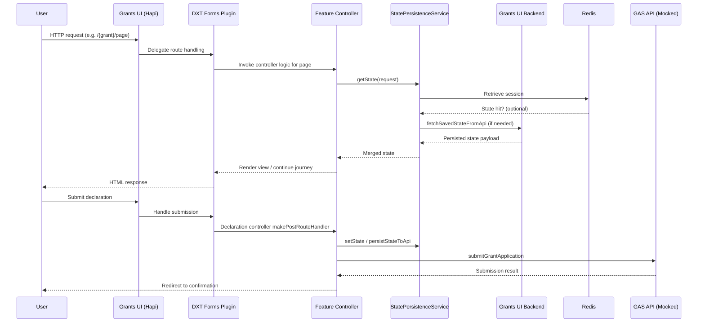

# Architecture

- [DXT Forms Engine Plugin](#dxt-forms-engine-plugin)
  - [Forms Engine State Model](#forms-engine-state-model)
- [Task Lists](#task-lists)
  - [Configuration](#configuration)
  - [Defining Sections and Tasks](#defining-sections-and-tasks)
  - [How Task Completion Works](#how-task-completion-works)
  - [Task Statuses](#task-statuses)
  - [Navigation Behaviour](#navigation-behaviour)
  - [Integration with Grant Redirect Rules](#integration-with-grant-redirect-rules)
- [Development Services Integration](#development-services-integration)
- [Grant Form Definitions](#grant-form-definitions)
- [GAS Integration](#gas-integration)
  - [Submission Schema Validators](#submission-schema-validators)
  - [Using the gas.http Helper](#using-the-gashttp-helper-and-http-client-environments)
  - [Grant Schema Updates](#grant-schema-updates)
- [Config-Driven Confirmation Pages](#config-driven-confirmation-pages)
- [Print Submitted Application](#print-submitted-application)

## DXT Forms Engine Plugin

Grants UI uses the [DXT Forms Engine](https://github.com/DEFRA/dxt-forms-engine) to render forms.

We override the default DXT SummaryPageController which is used as a combined "check answers" and "submit" page, to provide these as separate pages.

CheckResponsesPageController renders a page showing the questions and answers the user has completed, and allows the user to change their answers.

DeclarationPageController renders a declaration page and submits the form to GAS. It does not use the `confirmationState` used by DXT and does not clear the state.
Instead it sets `applicationStatus` to `SUBMITTED` along with `submittedAt` and `submittedBy` fields.

### Forms Engine State Model

DXT Controllers pass a `context` object into every handler. Grants UI relies on two key properties:

- `context.state`: the full mutable state bag for the current journey. Grants UI stores intermediate answers, lookups, and UI scaffolding here (for example `context.state.applicantContactDetails`). Use the helper methods exposed by the base controllers—primarily `await this.setState(request, newState)` or `await this.mergeState(request, context.state, update)`—to persist changes so they flow through the cache layer (`QuestionPageController.setState`, `QuestionPageController.mergeState` in the forms engine plugin).
- `context.relevantState`: a projection produced by the forms engine that contains only the answers needed for submission. This is the source of truth used by declaration/confirmation controllers when building payloads for GAS (see `DeclarationPageController`).

StatePersistenceService persists both structures through the Grants UI Backend API (which stores data in MongoDB) so that state survives page refreshes and "save and return" flows. Redis is used separately for session caching (auth cookies, Yar session data, tasklist temp data) but not for form state persistence. When working on new controllers, prefer `context.relevantState` for data you plan to submit, and use `context.state` for auxiliary UI data. Changes to either must be serialisable because the persistence layer stores them as JSON.

Practical usage tips:

- `await this.setState(request, { ...context.state, applicantContactDetails: updated })` completely replaces the stored state for the current journey.
- `await this.mergeState(request, context.state, { applicantContactDetails: updated })` applies a shallow merge when you only need to tweak a subset of keys.
- Never mutate `context.state` in place; always go through the helpers so that the new state is flushed through the cache service and persisted for save-and-return flows.



## Task Lists

Task lists provides a structured, configurable way to organize grant application forms into multiple sections and tasks, allowing users to track their progress through complex multi-step applications. Task lists automatically determine completion status based on form state and provide flexible navigation between sections.

### What Task Lists Are Used For

Task lists are ideal for:

- **Complex multi-section forms**: Breaking down large grant applications into manageable sections
- **Progress tracking**: Showing users which sections are completed, available, or not yet available
- **Sequential workflows**: Enforcing that tasks must be completed in order (optional)
- **Flexible navigation**: Allowing users to return to any section to review or update answers
- **Save and return journeys**: Providing clear resumption points for users across sessions

### Configuration

Task lists are configured in the form YAML definition under `metadata.tasklist` with the following options:

```yaml
metadata:
  tasklist:
    completeInOrder: true # Optional, defaults to true - must complete tasks in order
    returnAfterSection: true # Optional, defaults to true - returns to task list after each section
    showCompletionStatus: true # Optional, defaults to true - show "X of Y" completion status
    statuses: # Optional status display overrides
      cannotStart:
        text: 'Cannot start yet'
        classes: 'govuk-tag--grey'
      notStarted:
        text: 'Not started'
        classes: 'govuk-tag--blue'
      completed:
        text: 'Completed'
        classes: 'govuk-tag--green'
```

### Defining Sections and Tasks

#### 1. Define sections

Sections group related tasks together and must be declared at the form level:

```yaml
sections:
  - name: applicant-details
    title: Applicant details
  - name: business-information
    title: Business information
  - name: submission
    title: Review and submit
```

If only 1 section is used, section headers will be hidden on the task list page and all task pages.

#### 2. Create the task list page

Add a task list page using the `TaskListPageController`:

```yaml
pages:
  - title: Application tasks
    path: /tasks
    controller: TaskListPageController
    components:
      - name: guidance
        type: Details
        title: How to use this task list
        content: |
          <p class="govuk-body">Complete all sections before submitting.</p>
        options:
          position: above # Renders above the task list
```

Components can be positioned `above` or `below` the task list to provide guidance.

#### 3. Add task pages to sections

Task pages are regular form pages with a `section` property and must use `TaskPageController`:

```yaml
pages:
  - title: Your name
    path: /your-name
    section: applicant-details
    controller: TaskPageController
    components:
      - name: firstName
        type: TextField
        title: First name
        options:
          required: true
      - name: lastName
        type: TextField
        title: Last name
        options:
          required: true
```

### How Task Completion Works

Tasks are automatically marked as completed when all required fields on the page have values in the form state:

- **Question components** (TextField, EmailAddressField, RadiosField, etc.) are tracked for completion
- **Guidance components** (Html, Details, etc.) are ignored
- **Optional fields** (`required: false`) are ignored
- **Compound components** (e.g. UkAddressField) are completed when any subfield exists in state

### Task Statuses

The system provides three standard statuses:

| Status           | Default Text       | Default Class      | When Shown                                                  |
| ---------------- | ------------------ | ------------------ | ----------------------------------------------------------- |
| Completed        | "Completed"        | `govuk-tag--green` | All required fields on the page have values                 |
| Not started      | "Not started"      | `govuk-tag--blue`  | No required fields completed, and prerequisites met         |
| Cannot start yet | "Cannot start yet" | `govuk-tag--grey`  | Previous tasks not completed (when `completeInOrder: true`) |

Customise these in the YAML configuration under `metadata.tasklist.statuses`.

### Navigation Behaviour

#### Sequential completion (`completeInOrder: true`)

- Tasks must be completed in the order they appear in sections
- Tasks show "Cannot start yet" until previous tasks are completed

#### Free navigation (`completeInOrder: false`) **(TODO)**

- Users can complete tasks in any order
- All tasks show as "Not started" or "Completed"
- Useful for forms with independent sections

#### Section by section flow (`returnAfterSection: true`)

- After completing all pages in a section, users return to the task list
- Back links on first page of each section return to task list
- Allows users to track progress and choose next section

#### Continuous flow (`returnAfterSection: false`)

- Users flow directly from one section to the next
- Back links use standard DXT behavior
- Useful for linear workflows that happen to use sections

### Integration with Grant Redirect Rules

Task lists integrate with the grant redirect rules system:

```yaml
metadata:
  grantRedirectRules:
    preSubmission:
      - toPath: '/tasks' # Redirect to task list before submission
    postSubmission:
      - fromGrantsStatus: SUBMITTED
        gasStatus: APPLICATION_AMEND
        toGrantsStatus: REOPENED
        toPath: /tasks # Return to task list when amendments needed
```

### Example Complete Configuration

See `src/server/common/forms/definitions/example-grant-with-task-list.yaml` for a complete working example that demonstrates:

- Multiple sections with different types of tasks
- Above and below positioned guidance components
- Required and optional fields
- Compound components (UkAddressField)
- Custom validation messages
- Integration with declaration and confirmation pages

## Development Services Integration

The following services are available via Docker Compose for local development:

- **Grants UI Backend**: Separate Node.js service (`defradigital/grants-ui-backend`) for data persistence
- **MongoDB**: Document database used by the backend service for storing application data
- **FFC Grants Scoring**: External scoring service (`defradigital/ffc-grants-scoring`) for grant evaluation
- **MockServer**: API mocking service for development and testing with predefined expectations
- **Defra ID Stub**: Local OpenID Connect provider used to mimic Defra ID authentication flows
- **GAS API (Mocked)**: Grants Application Service endpoint stubbed by MockServer for submissions and confirmation flows

```mermaid
graph TD
  User[Browser / User] -->|HTTP :3000| UI[Grants UI]
  UI -->|Session data| Redis[(Redis)]
  UI -->|State API| Backend[Grants UI Backend]
  Backend -->|Persist/Fetch| Mongo[(MongoDB)]
  UI -->|Scoring request| Scoring[FFC Grants Scoring]
  UI -->|Grant submission| GAS[MockServer (GAS API)]
  UI -.->|OIDC flows| DefraID[Defra ID Stub]
```

For complete service configuration and setup, see [Docker Compose](./DOCKER.md#docker-compose).

## Grant Form Definitions

Grant form definitions can be sourced in two ways:

### 1. Local YAML files (default)

Form definitions are stored in `src/server/common/forms/definitions` as YAML files and read at startup. Any changes to these files require a restart of the application.

Forms will not be enabled in production unless the YAML file contains the `enabledInProd: true` property.

### 2. Config API

When `CONFIG_API_URL` and `FORMS_API_SLUGS` are set, the application fetches the specified form definitions from the `grants-ui-config-api` at startup and caches them in Redis for `FORMS_API_CACHE_TTL_SECONDS` seconds. This allows form definitions to be updated without redeploying the application.

Slugs listed in `FORMS_API_SLUGS` are loaded from the API; all other forms continue to be loaded from local YAML files. The two sources can be used together.

To upload local YAML definitions to the Config API, see [tools/README.md](../tools/README.md).

## GAS Integration

The Grants Application Service (GAS) is used to store grant definitions that the app submits data against.

Creating a Grant Definition
A grant definition is created via the GAS backend by making a POST request to the /grants endpoint (see postman folder in the root of the project). This defines the structure and schema of the grant application payload, which the app will later submit.

You can also create a grant using the [GAS API](https://github.com/DEFRA/fg-gas-backend). For API documentation and examples, see the [fg-gas-backend repository](https://github.com/DEFRA/fg-gas-backend).

Example request (truncated - see [GAS API documentation](https://github.com/DEFRA/fg-gas-backend) for full schema):

```bash
curl --location --request POST 'https://fg-gas-backend.dev.cdp-int.defra.cloud/grants' \
--header 'Content-Type: application/json' \
--data-raw '{
  "code": "example-grant-with-auth",
  "questions": {
    "$schema": "https://json-schema.org/draft/2020-12/schema",
    "title": "GrantApplicationPayload",
    "type": "object",
    "properties": {
      "yesNoField": { "type": "boolean" },
      "autocompleteField": { "type": "string" },
      "radiosField": { "type": "string" },
      "applicantName": { "type": "string" },
      "applicantEmail": { "type": "string", "format": "email" }
      // ... additional fields as required
    }
  }
}'
```

Example response:

```
{
    "code": "example-grant-with-auth"
}
```

### Submission Schema Validators

Each GAS grant may define a JSON Schema stored locally in:

`src/server/common/forms/schemas/`

Each schema file is named after the grant code
(e.g. example-grant-with-auth.json) and describes the shape of the expected application payload for that grant.

At application startup, the app scans the schemas directory and compiles each schema into a JSON Schema validator using Ajv. These compiled validators are stored in-memory in a map of the form:

`Map<string, ValidateFunction>`

#### Current Runtime Behaviour

Although the validators are compiled at startup, they are not currently used at runtime to validate submissions within the grants-ui submission pipeline.

The helper:

`validateSubmissionAnswers(payload, grantCode)`

is currently used only in tests to ensure that the mapping logic produces payloads that conform to the expected schema format.

### Using the `gas.http` helper and HTTP client environments

For local development and manual testing of grant definitions and submissions against GAS, this repository includes:

- `gas.http` -- an HTTP client collection with example requests for:
  - creating grant definitions in GAS for `example-grant-with-auth`
  - submitting example applications for those grants
- `http-client.env.json` -- shared, non-secret environment configuration (base URLs)
- `http-client.private.env.json` -- per-environment secrets (service tokens and API keys)

Most IDEs (including JetBrains IDEs and VS Code with the REST Client extension) can execute the requests in `gas.http` using these environment files.

#### `http-client.env.json` (public envs)

The `http-client.env.json` file defines the non-secret per-environment configuration used by `gas.http`:

```json
{
  "local": {
    "base": "http://localhost:3000"
  },
  "dev": {
    "base": "https://ephemeral-protected.api.dev.cdp-int.defra.cloud/fg-gas-backend"
  },
  "test": {
    "base": "https://ephemeral-protected.api.test.cdp-int.defra.cloud/fg-gas-backend"
  },
  "perf-test": {
    "base": "https://ephemeral-protected.api.perf-test.cdp-int.defra.cloud/fg-gas-backend"
  }
}
```

You can safely commit this file to version control as it contains no secrets.

#### `http-client.private.env.json` (secrets -- do not commit)

The `http-client.private.env.json` file contains per-environment secrets required by the `gas.http` requests and **must not** be committed. Ensure it is listed in `.gitignore`.

Create this file locally using the following template:

```json
{
  "local": {
    "serviceToken": "<local-service-token>",
    "x-api-key": "local"
  },
  "dev": {
    "serviceToken": "<dev-service-token>",
    "x-api-key": "<dev-x-api-key>"
  }
}
```

Populate the placeholders as follows (do **not** paste real secrets into the repo):

- `x-api-key` -- obtain this per-environment value from the CDP portal user profile page:
  - `https://portal.cdp-int.defra.cloud/user-profile`
- `serviceToken` -- a GAS service token which must be minted and configured in GAS for each environment:
  - generate the token using the GAS tooling
  - register it in GAS (for example by adding it to the appropriate collection in GAS MongoDB)
  - use the raw token value here

Once `http-client.private.env.json` is created and populated, you can:

1. Select the desired environment (e.g. `local` or `dev`, etc) in your HTTP client.
2. Use the `Create ...` requests in `gas.http` to define grants in GAS.
3. Use the corresponding `Submit application ...` requests to send example application payloads and verify end-to-end integration.

### Grant Schema Updates

In order to update a grant schema, see the [GAS API repository](https://github.com/DEFRA/fg-gas-backend) for documentation and examples.

Find the endpoint `GET /grants/{code}`, pass in the code, e.g. `example-grant-with-auth`, will return the grant.

When changes have been made to the schema, use the endpoint `PUT /tmp/grants/{code}` to update the grant schema.

In order to test if your schema change has worked, send through an application, and view the case tool, to see if your new data exists in the case:

https://fg-cw-frontend.dev.cdp-int.defra.cloud/cases

From here you can find the `caseId`, use the below swagger to query the `GET /cases/{caseId}`

https://fg-cw-backend.dev.cdp-int.defra.cloud/documentation#/

## Config-Driven Confirmation Pages

The application supports config-driven confirmation pages that allow forms to define custom confirmation content through YAML configuration. This provides a flexible way to create tailored confirmation experiences for different grants without code changes.

### What you can add

- Custom HTML content with GOV.UK Design System components
- Reusable template components through placeholders
- Dynamic content insertion using session data (reference numbers, business details, etc.)

### How to Use Config Confirmations

#### Define Confirmation Content in Form YAML

Please see journeys for examples

#### Route Configuration

The config confirmation system automatically handles routes matching `/{slug}/confirmation` for any form that has `confirmationContent` defined in its YAML configuration.

### Reusable Template Components

The system includes a components registry that allows you to define reusable HTML snippets that can be inserted into confirmation content using placeholders.

#### Available Components

- `{{DEFRASUPPORTDETAILS}}` - Renders contact information and support details for DEFRA

Simply include the placeholder in your confirmation content HTML:

```yaml
confirmationContent:
  html: |
    <h2 class="govuk-heading-m">Application submitted</h2>
    <p class="govuk-body">Your reference number is: <strong>{{referenceNumber}}</strong></p>

    {{DEFRASUPPORTDETAILS}}
```

#### Adding New Reusable Components

Register new components in `src/server/confirmation/services/components.registry.js`:

```javascript
ComponentsRegistry.register(
  'myComponent',
  `<div class="govuk-inset-text">
    <p>This is a reusable component</p>
  </div>`
)
```

Then use it in your YAML with `{{MYCOMPONENT}}` (uppercase).

### Testing Confirmation Pages

See [Development Tools](./DEV-TOOLS.md) for routes to test and preview confirmation pages during development.

## Print Submitted Application

The application provides a print/download view for submitted grant applications. After a user submits their application, they can access a printer-friendly page that displays all their submitted answers in a clean, printable format.

### Route

**`GET /{slug}/print-submitted-application`**

This route is only accessible when the application has been submitted (i.e. `applicationStatus === SUBMITTED` in the session state). If the application has not been submitted, a `403 Forbidden` response is returned.

### What It Displays

The print view includes:

- **Application reference number** from the submitted state
- **Applicant details** (contact name, business name, SBI) from the session
- **All submitted answers** grouped by page, with display-only components (Html, Details, InsetText, etc.) filtered out
- **A print button** that triggers the browser's print dialog
- **Contact details** for the Rural Payments Agency

### Print Styles

Print-specific CSS (`src/client/stylesheets/components/_print-application.scss`) hides the header, footer, navigation, phase banner, print button, and contact details when printing, and expands the content to full width.

### Implementation

The feature is implemented across:

- `src/server/print-submitted-application/` - Controller and Nunjucks view
- `src/server/common/helpers/print-application-service/` - Shared service for building the print view model, answer formatting, and constants
