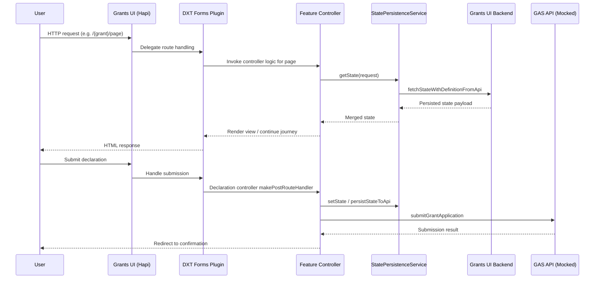

# Architecture

- [DXT Forms Engine Plugin](#dxt-forms-engine-plugin)
  - [Forms Engine State Model](#forms-engine-state-model)
- [Task Lists](#task-lists)
  - [Configuration](#configuration)
  - [Defining Sections and Tasks](#defining-sections-and-tasks)
  - [How Task Completion Works](#how-task-completion-works)
  - [Task Statuses](#task-statuses)
  - [Navigation Behaviour](#navigation-behaviour)
  - [Integration with Grant Redirect Rules](#integration-with-grant-redirect-rules)
- [Development Services Integration](#development-services-integration)
- [Grant Form Definitions](#grant-form-definitions)
- [GAS Integration](#gas-integration)
  - [Using the HTTP client helpers](#using-the-http-client-helpers-and-http-client-environments)
  - [Grant Schema Updates](#grant-schema-updates)
- [Config-Driven Confirmation Pages](#config-driven-confirmation-pages)
- [Print Submitted Application](#print-submitted-application)

## DXT Forms Engine Plugin

Grants UI uses the [DXT Forms Engine](https://github.com/DEFRA/dxt-forms-engine) to render forms.

We override the default DXT SummaryPageController which is used as a combined "check answers" and "submit" page, to provide these as separate pages.

CheckResponsesPageController renders a page showing the questions and answers the user has completed, and allows the user to change their answers.

DeclarationPageController renders a declaration page and submits the form to GAS. It does not use the `confirmationState` used by DXT and does not clear the state.
Instead it sets `applicationStatus` to `SUBMITTED` along with `submittedAt` and `submittedBy` fields.

### Forms Engine State Model

DXT Controllers pass a `context` object into every handler. Grants UI relies on two key properties:

- `context.state`: the full mutable state bag for the current journey. Grants UI stores intermediate answers, lookups, and UI scaffolding here (for example `context.state.applicantContactDetails`). Use the helper methods exposed by the base controllers—primarily `await this.setState(request, newState)` or `await this.mergeState(request, context.state, update)`—to persist changes so they flow through the cache layer (`QuestionPageController.setState`, `QuestionPageController.mergeState` in the forms engine plugin).
- `context.relevantState`: a projection produced by the forms engine that contains only the answers needed for submission. This is the source of truth used by declaration/confirmation controllers when building payloads for GAS (see `DeclarationPageController`).

StatePersistenceService persists `context.state` through the Grants UI Backend API (which stores data in MongoDB) so that state survives page refreshes and "save and return" flows. `context.relevantState` is not itself persisted — it is recomputed by the forms engine from `context.state` on every request, so it is always current without a separate write. Redis is used separately for session caching (auth cookies, Yar session data) but not for form state persistence. When working on new controllers, prefer `context.relevantState` for data you plan to submit, and use `context.state` for auxiliary UI data. Changes to either must be serialisable because the persistence layer stores them as JSON.

Practical usage tips:

- `await this.setState(request, { ...context.state, applicantContactDetails: updated })` completely replaces the stored state for the current journey.
- `await this.mergeState(request, context.state, { applicantContactDetails: updated })` applies a shallow merge when you only need to tweak a subset of keys.
- Never mutate `context.state` in place; always go through the helpers so that the new state is flushed through the cache service and persisted for save-and-return flows.


```mermaid
sequenceDiagram
  participant User
  participant Hapi as Grants UI (Hapi)
  participant DXT as DXT Forms Plugin
  participant Ctrl as Feature Controller
  participant Cache as StatePersistenceService
  participant Backend as Grants UI Backend
  participant GAS as GAS API (Mocked)

  User->>Hapi: HTTP request (e.g. /{grant}/page)
  Hapi->>DXT: Delegate route handling
  DXT->>Ctrl: Invoke controller logic for page
  Ctrl->>Cache: getState(request)
  Cache->>Backend: fetchStateWithDefinitionFromApi
  Backend-->>Cache: Persisted state payload
  Cache-->>Ctrl: Merged state
  Ctrl-->>DXT: Render view / continue journey
  DXT-->>User: HTML response
  User->>Hapi: Submit declaration
  Hapi->>DXT: Handle submission
  DXT->>Ctrl: Declaration controller makePostRouteHandler
  Ctrl->>Cache: setState / persistStateToApi
  Ctrl->>GAS: submitGrantApplication
  GAS-->>Ctrl: Submission result
  Ctrl-->>User: Redirect to confirmation
```

## Task Lists

Task lists provides a structured, configurable way to organize grant application forms into multiple sections and tasks, allowing users to track their progress through complex multi-step applications. Task lists automatically determine completion status based on form state and provide flexible navigation between sections.

### What Task Lists Are Used For

Task lists are ideal for:

- **Complex multi-section forms**: Breaking down large grant applications into manageable sections
- **Progress tracking**: Showing users which sections are completed, available, or not yet available
- **Sequential workflows**: Enforcing that tasks must be completed in order (optional)
- **Flexible navigation**: Allowing users to return to any section to review or update answers
- **Save and return journeys**: Providing clear resumption points for users across sessions

### Configuration

Task lists are configured in the form YAML definition under `metadata.tasklist` with the following options:

```yaml
metadata:
  tasklist:
    completeInOrder: true # Optional, defaults to true - must complete tasks in order
    returnAfterSection: true # Optional, defaults to true - returns to task list after each section
    showCompletionStatus: true # Optional, defaults to true - show "X of Y" completion status
    statuses: # Optional status display overrides
      cannotStart:
        text: 'Cannot start yet'
        classes: 'govuk-tag--grey'
      notStarted:
        text: 'Not started'
        classes: 'govuk-tag--blue'
      completed:
        text: 'Completed'
        classes: 'govuk-tag--green'
```

### Defining Sections and Tasks

#### 1. Define sections

Sections group related tasks together and must be declared at the form level:

```yaml
sections:
  - name: applicant-details
    title: Applicant details
  - name: business-information
    title: Business information
  - name: submission
    title: Review and submit
```

If only 1 section is used, the per-section subheading is hidden on the task list page. This does not extend to individual task pages — their section caption only hides when that section explicitly sets `hideTitle: true`, regardless of how many sections the form has.

#### 2. Create the task list page

Add a task list page using the `TaskListPageController`:

```yaml
pages:
  - title: Application tasks
    path: /tasks
    controller: TaskListPageController
    components:
      - name: guidance
        type: Details
        title: How to use this task list
        content: |
          <p class="govuk-body">Complete all sections before submitting.</p>
        options:
          position: above # Renders above the task list
```

Components can be positioned `above` or `below` the task list to provide guidance.

#### 3. Add task pages to sections

Task pages are regular form pages with a `section` property and must use `TaskPageController`:

```yaml
pages:
  - title: Your name
    path: /your-name
    section: applicant-details
    controller: TaskPageController
    components:
      - name: firstName
        type: TextField
        title: First name
        options:
          required: true
      - name: lastName
        type: TextField
        title: Last name
        options:
          required: true
```

### How Task Completion Works

Tasks are automatically marked as completed when all required fields on the page have values in the form state:

- **Question components** (TextField, EmailAddressField, RadiosField, etc.) are tracked for completion
- **Guidance components** (Html, Details, etc.) are ignored
- **Optional fields** (`required: false`) are ignored
- **Compound components** (e.g. UkAddressField) are completed when any subfield exists in state

### Task Statuses

The system provides three standard statuses, customisable in the YAML configuration under `metadata.tasklist.statuses`:

| Status           | Default Text       | Default Class       | When Shown                                                  |
| ---------------- | ------------------ | ------------------- | ----------------------------------------------------------- |
| Completed        | "Completed"        | `govuk-tag--green`  | All required fields on the page have values                 |
| Not started      | "Not started"      | `govuk-tag--yellow` | No required fields completed, and prerequisites met         |
| Cannot start yet | "Cannot start yet" | `govuk-tag--grey`   | Previous tasks not completed (when `completeInOrder: true`) |

Two further statuses exist for the alternative `showQuestions: false` display mode and are not currently configurable via `metadata.tasklist.statuses`:

| Status          | Default Text  | Default Class       |
| --------------- | ------------- | ------------------- |
| In progress     | "In progress" | `govuk-tag--blue`   |
| Cannot continue | "On hold"     | `govuk-tag--purple` |

### Navigation Behaviour

#### Sequential completion (`completeInOrder: true`)

- Tasks must be completed in the order they appear in sections
- Tasks show "Cannot start yet" until previous tasks are completed

#### Free navigation (`completeInOrder: false`) **(TODO)**

- Users can complete tasks in any order
- All tasks show as "Not started" or "Completed"
- Useful for forms with independent sections

#### Section by section flow (`returnAfterSection: true`)

- After completing all pages in a section, users return to the task list
- Back links on first page of each section return to task list
- Allows users to track progress and choose next section

#### Continuous flow (`returnAfterSection: false`)

- Users flow directly from one section to the next
- Back links use standard DXT behavior
- Useful for linear workflows that happen to use sections

### Integration with Grant Redirect Rules

Task lists integrate with the grant redirect rules system:

```yaml
metadata:
  grantRedirectRules:
    preSubmission:
      - toPath: '/tasks' # Redirect to task list before submission
    postSubmission:
      - fromGrantsStatus: SUBMITTED
        gasStatus: APPLICATION_AMEND
        toGrantsStatus: REOPENED
        toPath: /tasks # Return to task list when amendments needed
```

### Example Complete Configuration

See [`example-grant-with-task-list.yaml`](https://github.com/DEFRA/grants-config-example-grants/blob/main/configurations/example-grant-with-task-list/grants-ui/example-grant-with-task-list.yaml) in the grants config repo for a complete working example that demonstrates:

- Multiple sections with different types of tasks
- Above and below positioned guidance components
- Required and optional fields
- Compound components (UkAddressField)
- Custom validation messages
- Integration with declaration and confirmation pages

## Development Services Integration

For local development, Grants UI runs alongside several services via Docker Compose (backend, MongoDB, MockServer,
Defra ID Stub, config broker, and more) — see [Docker Compose](./DOCKER.md#docker-compose) for the full, current
service list. The request flow between the core services looks like this:

```mermaid
graph TD
  User[Browser / User] -->|HTTP :3000| UI[Grants UI]
  UI -->|Session data| Redis[(Redis)]
  UI -->|State API| Backend[Grants UI Backend]
  Backend -->|Persist/Fetch| Mongo[(MongoDB)]
  UI -->|Grant submission| GAS[MockServer (GAS API)]
  UI -.->|OIDC flows| DefraID[Defra ID Stub]
```

## Grant Form Definitions

All grant form definitions are sourced from `grants-ui-backend`. Definitions
are authored as YAML in the grants config repos and published per environment
by the config broker; grants-ui itself holds no local form definitions.

A form's slug is not known to grants-ui ahead of time; there is no list of
valid grants to register and nothing is cached or registered anywhere —
Redis plays no part in form definitions. The definition is resolved fresh per
request from the backend's combined `POST /state/with-definition` endpoint
(see [Forms Engine State Model](#forms-engine-state-model)), via
`state-with-definition-context.js`'s `AsyncLocalStorage`-backed request
context, and `formsService()` (`src/server/common/forms/services/form.js`)
derives everything else (`id`, `title`, `metadata`) from the slug and that
resolved definition. Allowlist enforcement (`allowlist.js` `onPostAuth`) applies
unconditionally to every authenticated request that carries a grant slug — see
[Auth & Security – Allowlist Functionality](./AUTH-AND-SECURITY.md#allowlist-functionality)
for the full mechanism.

One consequence of resolving everything per-request: there is no enumerable
list of grants in grants-ui, so the dev-tools demo pages are opened by slug
URL (e.g. `/dev/demo-confirmation/{slug}`) rather than picked from a list.

## GAS Integration

The Grants Application Service (GAS) is used to store grant definitions that the app submits data against.

Creating a Grant Definition
A grant definition is created via the GAS backend by making a POST request to the /grants endpoint (see the `http-client/gas.http` requests described below). This defines the structure and schema of the grant application payload, which the app will later submit.

You can also create a grant using the [GAS API](https://github.com/DEFRA/fg-gas-backend). For API documentation and examples, see the [fg-gas-backend repository](https://github.com/DEFRA/fg-gas-backend).

Example request (truncated - see [GAS API documentation](https://github.com/DEFRA/fg-gas-backend) for full schema):

```bash
curl --location --request POST 'https://fg-gas-backend.dev.cdp-int.defra.cloud/grants' \
--header 'Content-Type: application/json' \
--data-raw '{
  "code": "example-grant-with-auth",
  "questions": {
    "$schema": "https://json-schema.org/draft/2020-12/schema",
    "title": "GrantApplicationPayload",
    "type": "object",
    "properties": {
      "yesNoField": { "type": "boolean" },
      "autocompleteField": { "type": "string" },
      "radiosField": { "type": "string" },
      "applicantName": { "type": "string" },
      "applicantEmail": { "type": "string", "format": "email" }
      // ... additional fields as required
    }
  }
}'
```

Example response:

```
{
    "code": "example-grant-with-auth"
}
```

### Using the HTTP client helpers and HTTP client environments

For local development and manual testing of the backing services, the request collections live together in the `http-client/` folder:

- `http-client/gas.http` -- example requests for:
  - creating grant definitions in GAS for `example-grant-with-auth`
  - submitting example applications for those grants
- `http-client/broker.http` -- example requests against the grants config broker
- `http-client/dal.http` -- example requests against the DAL
- `http-client/land-grants.http` -- example requests against the Land Grants API, including the
  `/api/v1/wmp/payments/calculate` and `/api/v1/wmp/payments/calculate-by-total-area` payment calls
- `http-client.env.json` -- shared, non-secret environment configuration (base URLs)
- `http-client.private.env.json` -- per-environment secrets (service tokens and API keys)

The environment files remain in the repository root so they are resolved for every collection in `http-client/`.
Most IDEs (including JetBrains IDEs and VS Code with the REST Client extension) can execute these requests using the environment files.

#### `http-client.env.json` (public envs)

The `http-client.env.json` file defines the non-secret per-environment base URLs used by the collections in `http-client/`:

```json
{
  "local": {
    "gasUrl": "http://localhost:3102",
    "brokerUrl": "http://localhost:3012",
    "backendUrl": "http://localhost:3001",
    "landGrantsUrl": "http://localhost:3009",
    "dalUrl": "http://localhost:3008/graphql"
  },
  "dev": {
    "gasUrl": "https://ephemeral-protected.api.dev.cdp-int.defra.cloud/fg-gas-backend",
    "brokerUrl": "https://ephemeral-protected.api.dev.cdp-int.defra.cloud/grants-config-broker",
    "backendUrl": "https://ephemeral-protected.api.dev.cdp-int.defra.cloud/grants-ui-backend",
    "landGrantsUrl": "https://ephemeral-protected.api.dev.cdp-int.defra.cloud/land-grants-api",
    "dalUrl": "https://fcp-dal-api.api.dev.cdp-int.defra.cloud/graphql"
  }
}
```

You can safely commit this file to version control as it contains no secrets.

#### `http-client.private.env.json` (secrets -- do not commit)

The `http-client.private.env.json` file contains per-environment secrets required by the `gas.http`, `dal.http`, `broker.http` and `land-grants.http` requests and **must not** be committed. Ensure it is listed in `.gitignore`.

Generate the skeleton locally with the bundled tool rather than hand-crafting it:

- `npm run http-client:init` -- creates (or updates) `http-client.private.env.json` with an entry for every environment listed in `http-client.env.json`, leaving the hand-populated secrets as empty strings and generating the encrypted bearer tokens under the `local` environment. To generate the encrypted tokens under another environment, run the tool directly and pass `--env`, for example `node ./tools/init-http-client-secrets.js --env dev`.
- Existing values are preserved on re-run, and obsolete keys are dropped.
- A present-but-empty (or whitespace-only) `http-client.private.env.json` is treated the same as a missing file and (re)initialised rather than failing to parse.
- The `local` `serviceToken` is pre-filled from `GAS_API_AUTH_TOKEN` in `compose.gas.yml` so it matches the token the local GAS backend accepts (any value you have already set is preserved).
- Within each environment the secrets are grouped by the `http-client/*.http` file that uses them, with each group separated by a blank line for readability.

The generated skeleton looks like this (one block per environment):

```json
{
  "local": {
    "entraClientId": "",
    "entraClientSecret": "",
    "entraTenantId": "",

    "serviceToken": "<pre-filled-from-compose.gas.yml>",
    "x-api-key": "",

    "brokerAuthToken": "<generated-local-broker-auth-token>",

    "landGrantsAuthToken": "<generated-local-land-grants-api-token>",

    "defraIdToken": ""
  }
}
```

Populate the placeholders as follows (do **not** paste real secrets into the repo):

- `entraClientId`, `entraClientSecret`, `entraTenantId` -- Microsoft Entra ID client-credentials details used by `dal.http` to obtain a service-to-service OAuth2 token. Set these under the environment you intend to call the DAL from (for example `test`).
- `x-api-key` -- obtain this per-environment value from the CDP portal user profile page:
  - `https://portal.cdp-int.defra.cloud/user-profile`
- `serviceToken` -- a GAS service token which must be minted and configured in GAS for each environment:
  - generate the token using the GAS tooling
  - register it in GAS (for example by adding it to the appropriate collection in GAS MongoDB)
  - use the raw token value here
  - for `local`, this is pre-filled automatically from `GAS_API_AUTH_TOKEN` in `compose.gas.yml`, which matches the token seeded into the local GAS backend
- `brokerAuthToken` and `landGrantsAuthToken` -- AES-256-GCM encrypted + base64 bearer tokens for the config broker (`broker.http`) and Land Grants API (`land-grants.http`). These are **not** raw tokens: the backing services expect the same encrypted format the app produces (see `encryptToken` in `src/server/common/helpers/auth/encrypt-token.js`). `npm run http-client:init` generates both for you; the raw tokens and encryption keys are read from your `.env` file, defaulting to the `compose.grants-ui.yml` / `compose.land-grants.yml` development values (`GRANTS_CONFIG_BROKER_AUTH_TOKEN` / `GRANTS_CONFIG_BROKER_ENCRYPTION_KEY` and `LAND_GRANTS_API_AUTH_TOKEN` / `LAND_GRANTS_API_ENCRYPTION_KEY`) when unset.
- `defraIdToken` -- a Defra Identity access token for the signed-in user, forwarded via the `x-forwarded-authorization` header

Once `http-client.private.env.json` is created and populated, you can:

1. Select the desired environment (e.g. `local` or `dev`, etc) in your HTTP client.
2. Use the `Create ...` requests in `http-client/gas.http` to define grants in GAS.
3. Use the corresponding `Submit application ...` requests to send example application payloads and verify end-to-end integration.

### Grant Schema Updates

In order to update a grant schema, see the [GAS API repository](https://github.com/DEFRA/fg-gas-backend) for documentation and examples.

Find the endpoint `GET /grants/{code}`, pass in the code, e.g. `example-grant-with-auth`, will return the grant.

When changes have been made to the schema, use the endpoint `PUT /tmp/grants/{code}` to update the grant schema.

In order to test if your schema change has worked, send through an application, and view the case tool, to see if your new data exists in the case:

https://fg-cw-frontend.dev.cdp-int.defra.cloud/cases

From here you can find the `caseId`, use the below swagger to query the `GET /cases/{caseId}`

https://fg-cw-backend.dev.cdp-int.defra.cloud/documentation#/

## Config-Driven Confirmation Pages

The application supports config-driven confirmation pages that allow forms to define custom confirmation content through YAML configuration. This provides a flexible way to create tailored confirmation experiences for different grants without code changes.

### What you can add

- Custom HTML body content, authored as the page's standard `components:` list, with GOV.UK Design System markup
- Reusable template components through placeholders
- Dynamic content in the component body using state values (e.g. `referenceNumber`, `slug`)
- Multiple confirmation pages per grant, each with its own copy (for example an application confirmation and a claim confirmation)

### How to Use Config Confirmations

#### Define Confirmation Content in Form YAML

The confirmation panel copy is configured **per page**, under the page's `config:` block (which `hoistPageConfig` moves onto `metadata.pageConfig[path]`), like the declaration page. The confirmation body is authored as the page's standard `components:` list. Assign the `ConfirmationPageController` to the page and supply both:

```yaml
- title: Confirmation
  path: /confirmation
  controller: ConfirmationPageController
  config:
    panelTitle: 'Application submitted'
    panelText: 'Application reference number'
  components:
    - name: confirmationContent
      type: Html
      content: |
        <p class="govuk-body">We've received your application.</p>
        <p class="govuk-body"><a class="govuk-link" href="/{{ slug }}/print-submitted-application" target="_blank">View / Print submitted application (opens in new tab)</a></p>
```

A second confirmation page (for example the claim journey) reuses the same controller with its own copy and sets `confirmationType: claim` so the panel shows the claim number instead of the application reference number:

```yaml
- title: Confirmation
  path: /claim-confirmation
  controller: ConfirmationPageController
  config:
    confirmationType: claim
    panelTitle: 'Claim submitted'
    panelText: 'Your claim reference number'
  components:
    - name: claimConfirmationContent
      type: Html
      content: |
        <p class="govuk-body">We've received your claim.</p>
```

Each `Html` component's `content` is rendered with Nunjucks against the current journey state, so state values such as `{{ referenceNumber }}` and `{{ slug }}` can be interpolated in the body. The panel value depends on `config.confirmationType`: an application confirmation (the default) shows the application reference number from state, while a claim confirmation (`confirmationType: claim`) shows the most recent claim's `claimNumber` from `state.claims`. When the value is missing the panel falls back to `Not available`. `{{SLUG}}` and registered component placeholders (see below) are also substituted in the component content.

#### Route Configuration

Each confirmation page is resolved through the generic forms-engine route by assigning `controller: ConfirmationPageController` to the page. The panel copy is read from that page's own `config:` block and the body from its own `components:` list, so a grant can define more than one confirmation page.

### Reusable Template Components

The system includes a components registry that allows you to define reusable HTML snippets that can be inserted into confirmation content using placeholders.

#### Available Components

- `{{DEFRASUPPORTDETAILS}}` - Renders contact information and support details for DEFRA

Simply include the placeholder in an `Html` component's `content`:

```yaml
components:
  - name: confirmationContent
    type: Html
    content: |
      <h2 class="govuk-heading-m">Application submitted</h2>
      <p class="govuk-body">Your reference number is: <strong>{{ referenceNumber }}</strong></p>

      {{DEFRASUPPORTDETAILS}}
```

#### Adding New Reusable Components

Register new components in `src/server/confirmation/services/components.registry.js`:

```javascript
ComponentsRegistry.register(
  'myComponent',
  `<div class="govuk-inset-text">
    <p>This is a reusable component</p>
  </div>`
)
```

Then use it in your YAML with `{{MYCOMPONENT}}` (uppercase).

### Testing Confirmation Pages

See [Development Tools](./DEV-TOOLS.md) for routes to test and preview confirmation pages during development.

## Print Submitted Application

The application provides a print/download view for submitted grant applications. After a user submits their application, they can access a printer-friendly page that displays all their submitted answers in a clean, printable format.

### Route

**`GET /{slug}/print-submitted-application`**

This route is only accessible when the application has been submitted (i.e. `applicationStatus === SUBMITTED` in the session state). If the application has not been submitted, a `403 Forbidden` response is returned.

### What It Displays

The print view includes:

- **Application reference number** from the submitted state
- **Applicant details** (contact name, business name, SBI) from the session
- **All submitted answers** grouped by page, with display-only components (Html, Details, InsetText, etc.) filtered out
- **A print button** that triggers the browser's print dialog
- **Contact details** for the Rural Payments Agency

### Print Styles

Print-specific CSS (`src/client/stylesheets/components/_print-application.scss`) hides the header, footer, navigation, phase banner, print button, and contact details when printing, and expands the content to full width.

### Implementation

The feature is implemented across:

- `src/server/print-submitted-application/` - Controller and Nunjucks view
- `src/server/common/helpers/print-application-service/` - Shared service for building the print view model, answer formatting, and constants
