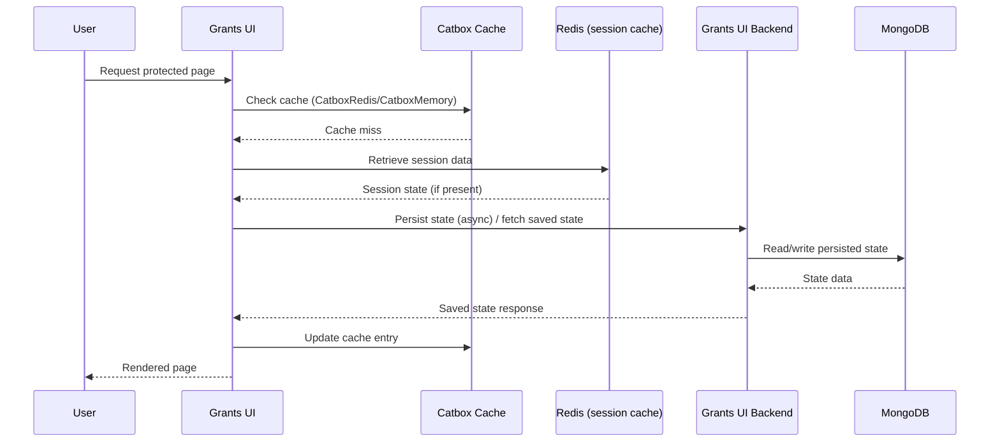
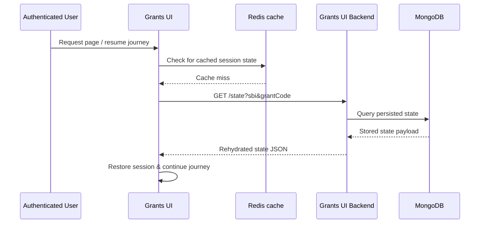

# Authentication & Security

- [Authentication & Security](#authentication--security-1)
  - [Whitelist Functionality](#whitelist-functionality)
- [Rate Limiting](#rate-limiting)
- [Agreements System](#agreements-system)
- [Cookies](#cookies)
  - [Inspecting Cookies](#inspecting-cookies)
- [Server-side Caching](#server-side-caching)
- [Session Rehydration](#session-rehydration)
- [Server-to-Server (S2S) Authentication](#server-to-server-s2s-authentication)
  - [Application Lock System](#application-lock-system)
- [Land Grants API Authentication](#land-grants-api-authentication)

## Authentication & Security

- **Defra ID Integration**: Primary authentication service using OpenID Connect (OIDC) protocol
  - For detailed environment variable configuration, see [Getting Started - DEFRA ID Integration](./GETTING-STARTED.md#defra-id-integration)
- **Whitelist System**: CRN (Customer Reference Number) and SBI (Single Business Identifier) whitelisting for specific grants:
  - `EXAMPLE_WHITELIST_CRNS`: Authorized CRNs for Example Grant journeys (used by the Example Whitelist form definition)
  - `EXAMPLE_WHITELIST_SBIS`: Authorized SBIs for Example Grant journeys (used by the Example Whitelist form definition)

### Whitelist Functionality

Whitelisting restricts access to specific grant journeys based on Customer Reference Numbers (CRNs) and Single Business Identifiers (SBIs). Forms that require whitelisting declare the relevant environment variables in their YAML definition (see [`src/server/common/forms/definitions/example-whitelist.yaml`](../src/server/common/forms/definitions/example-whitelist.yaml)). At runtime, the whitelist service (`src/server/auth/services/whitelist.service.js`) reads the configured environment variables, normalises the values, and validates incoming CRN/SBI credentials. If a user's identifiers are not present in the configured whitelist, the journey is terminated and the user is shown a terminal page.

## Rate Limiting

The application implements rate limiting to protect against abuse and denial-of-service attacks (CWE-400: Uncontrolled Resource Consumption). Rate limiting is implemented using [hapi-rate-limit](https://github.com/wraithgar/hapi-rate-limit).

### How It Works

- **Per-user limiting**: Limits requests per IP address within a configurable time window
- **Per-path limiting**: Limits total requests to specific endpoints
- **Auth endpoint protection**: Stricter limits on authentication endpoints to prevent brute-force attacks
- **IP extraction**: Correctly extracts client IP from `X-Forwarded-For` header when behind proxies/load balancers
- **Monitoring**: Logs rate limit violations with IP, path, user ID, and user agent for security monitoring

### Configuration

Rate limiting is controlled via environment variables:

| Variable                              | Description                                      | Default                  |
| ------------------------------------- | ------------------------------------------------ | ------------------------ |
| `RATE_LIMIT_ENABLED`                  | Enable/disable rate limiting                     | `true` (production only) |
| `RATE_LIMIT_TRUST_PROXY`              | Trust X-Forwarded-For header                     | `true`                   |
| `RATE_LIMIT_USER_LIMIT`               | Max requests per user (IP) per period            | `100`                    |
| `RATE_LIMIT_USER_LIMIT_PERIOD`        | Time window in milliseconds                      | `60000` (1 minute)       |
| `RATE_LIMIT_PATH_LIMIT`               | Max requests per path per period                 | `2000`                   |
| `RATE_LIMIT_AUTH_LIMIT`               | Max requests requiring authentication per period | `5`                      |
| `RATE_LIMIT_AUTH_ENDPOINT_USER_LIMIT` | Max requests per user to auth endpoints          | `10`                     |
| `RATE_LIMIT_AUTH_ENDPOINT_PATH_LIMIT` | Max requests per auth endpoint path              | `500`                    |

### Protected Endpoints

The following authentication endpoints have stricter rate limits (`authEndpointUserLimit` / `authEndpointPathLimit`) applied:

| Endpoint              | Method | Purpose                |
| --------------------- | ------ | ---------------------- |
| `/auth/sign-in`       | GET    | Sign-in initiation     |
| `/auth/sign-in-oidc`  | GET    | OIDC callback          |
| `/auth/sign-out`      | GET    | Sign-out               |
| `/auth/sign-out-oidc` | GET    | OIDC sign-out callback |

All other endpoints use the global rate limits (`userLimit` / `pathLimit`).

### Response Headers

When rate limiting is enabled, responses include headers indicating limit status:

- `X-RateLimit-Limit`: Maximum requests allowed
- `X-RateLimit-Remaining`: Requests remaining in current window
- `X-RateLimit-Reset`: Time when the limit resets (Unix timestamp)

### Rate Limit Exceeded

When a client exceeds the rate limit:

1. A `429 Too Many Requests` response is returned
2. The event is logged with client details for monitoring:
   ```
   [warn] Rate limit exceeded: path=/auth/sign-in, ip=192.168.1.100, userId=user123, userAgent=Mozilla/5.0...
   ```
3. A user-friendly error page is displayed

### Development Mode

Rate limiting is **disabled by default** in non-production environments to avoid friction during local development. To test rate limiting locally, set:

```bash
RATE_LIMIT_ENABLED=true
```

## Agreements System

The application includes a proxy endpoint for handling farming payment agreements, which forwards requests to an external agreements service.

**How It Works:**

The agreements controller acts as an authenticated proxy that:

- Accepts requests at `/agreements/{path*}`
- Extracts SBI (Single Business Identifier) from Defra ID credentials
- Generates a JWT token with SBI and source information
- Forwards requests to the external agreements service with authentication headers

**Configuration:**

| Variable                | Description                                  | Required |
| ----------------------- | -------------------------------------------- | -------- |
| `AGREEMENTS_UI_TOKEN`   | Bearer token for authenticating with the API | Yes      |
| `AGREEMENTS_UI_URL`     | Base URL of the agreements service           | Yes      |
| `AGREEMENTS_BASE_URL`   | Base path for agreements routes in grants-ui | Yes      |
| `AGREEMENTS_JWT_SECRET` | Secret key for signing JWT tokens            | Yes      |

**Example Configuration:**

```bash
AGREEMENTS_UI_TOKEN=your-bearer-token
AGREEMENTS_UI_URL=https://agreements-service.example.com
AGREEMENTS_BASE_URL=/agreement
AGREEMENTS_JWT_SECRET=your-jwt-secret
```

**Security:**

- Requires authenticated session (Defra ID)
- Uses JWT encryption for sensitive data transmission
- Validates configuration at startup

**Implementation:**

See `src/server/agreements/controller.js` for the proxy implementation.

## Cookies

We use the `@hapi/cookie` plugin to manage user sessions and `@hapi/yar` to manage cache. The session cookie is encrypted and signed using a high-entropy password set via the `SESSION_COOKIE_PASSWORD` environment variable.

The table below outlines the data the cookies control.

<table>
  <thead>
    <tr>
      <th>Cookie Name</th>
      <th>YAR managed</th>
      <th>Cache name</th>
      <th>Segment</th>
    </tr>
  </thead>
  <tbody>
    <tr>
      <td>grants-ui-session-auth</td>
      <td>No</td>
      <td>session-auth</td>
      <td>auth</td>
    </tr>
    <tr>
      <td rowspan="3">grants-ui-session-cache</td>
      <td>No</td>
      <td rowspan="3">session-cache</td>
      <td>tasklist-section-data</td>
    </tr>
    <tr>
      <td rowspan="2">Yes</td>
      <td>state</td>
    </tr>
    <tr>
      <td>formSubmission</td>
    </tr>
  </tbody>
</table>

### Inspecting Cookies

There is a tool provided `tools/unseal-cookie.js` that will decode and decrypt the cookies for inspection on the command line. You will need the appropriate cookie password.
To use the tool:

```bash
// With node directly
node ./tools/unseal-cookie.js '<cookie-string>' '<cookie-password>'

// With the NPM script
npm run unseal:cookie -- '<cookie-string>' '<cookie-password>'
```

## Server-side Caching

We use Catbox for server-side caching. By default the service will use CatboxRedis when deployed and CatboxMemory for
local development.
You can override the default behaviour by setting the `SESSION_CACHE_ENGINE` environment variable to either `redis` or
`memory`.

Please note: CatboxMemory (`memory`) is _not_ suitable for production use! The cache will not be shared between each
instance of the service and it will not persist between restarts.



## Session Rehydration

The application includes session rehydration functionality that allows user sessions to be restored from a backend API. This is particularly useful for maintaining user state across different services.

### How Session Rehydration Works

The application fetches saved state from the backend API using the endpoint configured in `GRANTS_UI_BACKEND_URL`.
When a user is authenticated, the service:

- Checks for existing cache
- If there is none, fetches data from the Grants UI Backend service (which persists data to Mongo)
- Performs session rehydration



### Configuration

Session rehydration is controlled by the following environment variables:

- `GRANTS_UI_BACKEND_URL`: The Grants UI Backend service endpoint used for state persistence
- `GRANTS_UI_BACKEND_AUTH_TOKEN`: Bearer token used to authenticate requests to the backend
- `GRANTS_UI_BACKEND_ENCRYPTION_KEY`: Encryption key used to secure the backend bearer token

### Error Handling

If session rehydration fails (e.g., backend unavailable, network issues), the application will:

- Log the error for debugging
- Continue normal operation without restored state
- Allow the user to proceed with a fresh session

## Server-to-Server (S2S) Authentication

When making API requests to backend services, our helpers handle the necessary authentication and headers. This ensures secure communication without requiring manual token management.

### Authorization Headers

The primary helper is:

```js
import { createApiHeadersForGrantsUiBackend } from '~/src/server/common/helpers/state/backend-auth-helper.js'
```

It generates headers that include:

- Content-Type: application/json
- Authorization: Bearer <encrypted-token> (if a token is configured)
- Optional additional headers

Example Usage

```js
const headers = createApiHeadersForGrantsUiBackend()
```

If a token is configured in the environment (`session.cache.authToken`), the helper automatically:

Encrypts the token using AES-256-GCM with the configured encryption key (session.cache.encryptionKey).

- Base64 encodes the encrypted token.
- Adds the Authorization header:

```js
Authorization: Bearer <base64-encrypted-token>
```

The helper preserves any custom base headers you pass:

```js
const headers = createApiHeadersForGrantsUiBackend({
  'User-Agent': 'my-service',
  'X-Custom-Header': 'value'
})
```

### Optional Lock Token

For operations that require a concurrency lock, you can pass an optional `lockToken`:

```js
const headers = createApiHeadersForGrantsUiBackend({ lockToken: 'LOCK-123' })
```

This adds an additional header:

```js
X-Application-Lock-Owner: LOCK-123
```

without affecting the Authorization header or any base headers.

### Application Lock System

The application implements a distributed lock mechanism to prevent concurrent modifications to the same application by multiple users or sessions.

#### How It Works

When a user accesses an application for editing:

1. A lock token is generated using JWT and the configured secret
2. The token is sent to the backend service with requests
3. The backend service validates the token and ensures only the lock holder can modify the application
4. Locks automatically expire after the configured TTL

#### Configuration

| Variable                        | Description                        | Default           |
| ------------------------------- | ---------------------------------- | ----------------- |
| `APPLICATION_LOCK_TOKEN_SECRET` | Secret key for signing lock tokens | (required)        |
| `APPLICATION_LOCK_TTL_MS`       | Lock time-to-live in milliseconds  | `14400000` (4hrs) |

**Note:** The same secret must be configured in both grants-ui and grants-ui-backend services.

#### Lock Headers

When operations require a lock, requests include:

```
X-Application-Lock-Owner: <JWT-token>
```

This header is automatically added by the `createApiHeadersForGrantsUiBackend` helper when a `lockToken` parameter is provided.

### Base Headers Only

If no token is configured, the helper returns only the base headers:

```js
{
  'Content-Type': 'application/json',
  'User-Agent': 'my-service'
}
```

## Land Grants API Authentication

The application now supports **server-to-server (S2S) authentication** when communicating with the **Land Grants API**.

When any request is made to the Land Grants API (e.g., `/payments/calculate`, `/parcels`), the system automatically includes an encrypted Bearer token in the `Authorization` header. This ensures secure, authenticated communication between services.

### How it works

1. The helper reads the following environment variables:
   - `LAND_GRANTS_API_AUTH_TOKEN` -- static bearer token used for authentication.
   - `LAND_GRANTS_API_ENCRYPTION_KEY` -- symmetric key used to encrypt the token.

2. The token is encrypted using **AES-256-GCM** before transmission.

3. The resulting value is encoded and set as the Bearer token in the `Authorization` header.

4. API clients like `land-grants.client.js` automatically include these headers in every request using:

   ```javascript
   import { createApiHeadersForLandGrantsBackend } from '~/src/server/common/helpers/state/backend-auth-helper.js'

   const response = await fetch(`${baseUrl}/payments/calculate`, {
     method: 'POST',
     headers: createApiHeadersForLandGrantsBackend(),
     body: JSON.stringify(payload)
   })
   ```

### Example Authorization Header

```
Authorization: Bearer <base64-encoded-encrypted-token>
Content-Type: application/json
```

### Environment Variables

| Variable                         | Description                                               |
| -------------------------------- | --------------------------------------------------------- |
| `LAND_GRANTS_API_AUTH_TOKEN`     | Bearer token used to authenticate to the Land Grants API. |
| `LAND_GRANTS_API_ENCRYPTION_KEY` | Key used to encrypt the auth token before transmission.   |

This mechanism provides a secure, environment-driven way to authenticate backend-to-backend requests without exposing plain-text tokens in configuration or logs.
