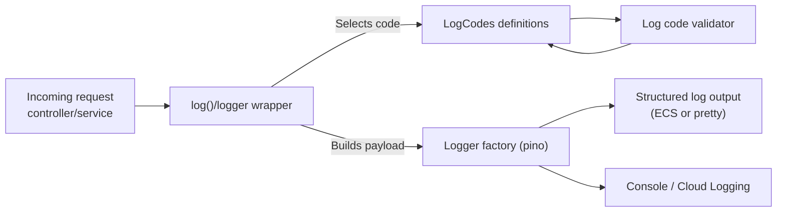

# Logging & Error Handling

- [Structured Error Handling](#structured-error-handling)
  - [Constructing Error Classes](#constructing-error-classes)
  - [Throwing Errors](#throwing-errors)
  - [Chaining Errors](#chaining-errors)
  - [Managing Error Instances](#managing-error-instances)
- [Structured Logging System](#structured-logging-system)
  - [Core Components](#core-components)
  - [Directory Structure](#directory-structure)
  - [Log Code Categories](#log-code-categories)
  - [Usage Examples](#usage-examples)
  - [Log Code Structure](#log-code-structure)
  - [Configuration](#configuration)
  - [Best Practices](#best-practices)
  - [Integration Points](#integration-points)
  - [Testing](#testing)
  - [Monitoring and Observability](#monitoring-and-observability)
  - [Standard Logging Approach](#standard-logging-approach)
  - [Adding New Log Codes](#adding-new-log-codes)
  - [Development Workflow](#development-workflow)

## Structured Error Handling

This is a work in progress (as of 12/02/2026)

### Tasks remaining

- [x] BaseError class with structured properties and logging
- [x] Example error classes extending BaseError (`AuthError` and `ViewError` currently)
- [x] Global error handler to format responses and log errors
- [ ] Update existing code to throw specific error classes instead of generic `Error`
- [ ] Update existing code to remove any manual logging of errors in `try {} catch {}` blocks
- [ ] Create ESLint rule to forbid logging in `try {} catch {}` blocks.

### Introduction to structured errors

The application implements a structured error handling approach to ensure consistent error responses and logging across
all components.

Starting with a `BaseError` class, specific error types are defined for different contexts (e.g., `ValidationError`,
`ExternalApiError`, etc.). Each error includes structured properties such as `code`, `message`, `details`, and
`statusCode`.
Errors are thrown with relevant context and caught by a global error handler that formats the response and logs the
error in a structured format.

> [!IMPORTANT]
> There is no need to log errors manually as long as the `BaseError` class is used consistently for propagation of all errors.

### Constructing error classes

The abstract `BaseError` class provides a consistent structure for all errors in the application. When defining specific
error types, they should extend `BaseError` and decorate any behaviours such as logging. `AuthError` is a good example
of this in action. The base class has a number of different properties that can be modified to change behaviour.

The constructor takes an object as its only argument. This object can include the following properties:

| Property             | Description                                                                                                                                                           |
| -------------------- | --------------------------------------------------------------------------------------------------------------------------------------------------------------------- |
| `message`            | A human-readable message describing the error. This should be concise and informative                                                                                 |
| `status`             | The HTTP status code to return in the response when this error is thrown. This allows for consistent error responses across the application.                          |
| `source`             | A string indicating the source or context of the error (e.g.,`'validation'`, `'external-api'`, etc.). This can be used for categorizing errors in logs and responses. |
| `reason`             | A string providing a more specific reason for the error, which can be used for debugging and analytics.                                                               |
| `[key: string]: any` | Any additional properties relevant to the error context can be added as needed. These will be included in the structured logs when the error is thrown.               |

Additionally the class has a property `logCode` that can be overridden with a custom log code (from log code
definitions) to modify how the error is logged.

### Throwing errors

When throwing errors, only use specific error classes that extend `BaseError` and provide relevant context:

```javascript
class ValidationError extends BaseError {
  constructor() {
    super({ message: 'Validation failed', status: 401, source: 'source', reason: 'reason' })
  }
}

throw new ValidationError()
```

There is a `preResponse` hook in the Hapi server that checks if the response is an error and if it is an instance of
`BaseError`. If so, it logs the error using `BaseError::log` and formats the response with the appropriate status code
and message. So there is never a need to log errors directly in `try {} catch {}` blocks.

### Chaining errors

When catching and re-throwing errors, the original error should be attached using the `from` method (`Baseclass::from`)
to preserve a detailed error chain. Many errors can be chained in this way, and logging the most recent error using
`BaseError::log` will include the full chain of errors in the log output, each with their own log entry but with a
`{ isChainedError: true }` added as additional data.

```javascript
class FieldInputError extends BaseError {}

const validationError = new ValidationError()
const fieldInputError = new FieldInputError({
  message: 'Invalid input for field X',
  status: 400,
  source: 'fieldInput',
  reason: 'invalid-format'
})
fieldInputError.from(validationError)

throw fieldInputError
```

Both of these errors will now be logged when `fieldInputError` is thrown, and the log output will include the full chain
of errors with their respective messages, stack traces, and any additional context provided.

### Managing `Error` instances

When errors are thrown by third party libraries or built-in Node.js modules, they can be referenced by a `BaseError`
instance using the `from` method to preserve the original error message and stack trace while adding structured context
and ensuring it is logged correctly.

```javascript
import fs from 'node:fs'

class FileReadError extends BaseError {}

try {
  const file = fs.readFile('abc.csv')
} catch (err) {
  const newError = new FileReadError({
    message: 'Failed to read file',
    status: 500,
    source: 'node:fs',
    reason: 'read-error'
  })
  newError.from(err)
  throw newError
}
```

> [!IMPORTANT]
> Instances of `Error` in the chain will always be wrapped in a `GenericError` class that extends `BaseError` to ensure they are logged with a consistent structure allowing them to be chained to and from other errors.

If you would prefer to manually wrap the error you can use the static method `BaseError::wrap`.

```javascript
try {
  const file = fs.readFile('abc.csv')
} catch (err) {
  throw BaseError.wrap(err)
}
```

For logging purposes we always want to find the root errors in the chain before starting to log. While there are no use cases to find the root errors outside of logging today, if needs be the root errors can be found using `BaseError.findRootErrors(error)` which will return an array of all root errors in the chain (i.e. all errors that do not have any parent errors attached to them).

## Structured Logging System

The application implements a comprehensive structured logging system providing consistent, searchable, and maintainable logging across all components.

### Core Components

- **Logger**: Pino-based logger with ECS format support
- **Log Codes**: Structured, hierarchical log definitions
- **Validation**: Runtime validation of log code definitions
- **Tracing**: Distributed tracing with request correlation



### Directory Structure

```
src/server/common/helpers/logging/
├── logger-options.js      # Logger configuration
├── request-logger.js      # Hapi request logger plugin
├── log.js                 # Structured logging wrapper
├── log-codes.js           # Structured log definitions
├── log-code-validator.js  # Log code validation
└── *.test.js             # Test files
```

### Log Code Categories

The system organizes log codes into logical categories:

- **AUTH**: Authentication and authorization events
- **FORMS**: Form processing and validation
- **SUBMISSION**: Grant submission lifecycle
- **DECLARATION**: Declaration page processing
- **CONFIRMATION**: Confirmation page processing
- **TASKLIST**: Task list management
- **LAND_GRANTS**: Land grant specific functionality
- **AGREEMENTS**: Agreement processing
- **SYSTEM**: System-level events and errors

### Usage Examples

#### Basic Structured Logging

```javascript
import { log, LogCodes } from '~/src/server/common/helpers/logging/log.js'

// Log successful authentication
log(LogCodes.AUTH.SIGN_IN_SUCCESS, {
  userId: 'user123',
  organisationId: 'org456'
})

// Log form submission
log(LogCodes.SUBMISSION.SUBMISSION_SUCCESS, {
  grantType: 'example-grant-with-auth',
  referenceNumber: 'REF123456'
})

// Log validation error
log(LogCodes.FORMS.FORM_VALIDATION_ERROR, {
  formName: 'declaration',
  errorMessage: 'Required field missing'
})
```

#### Direct Logger Access

```javascript
import { logger } from '~/src/server/common/helpers/logging/log.js'

// For simple logging when structured codes aren't needed
logger.info('Simple info message')
logger.error(error, 'Error with context')
```

### Log Code Structure

Each log code must have two required properties:

```javascript
{
  level: 'info' | 'debug' | 'error',
  messageFunc: (messageOptions) => string
}
```

Example log code definition:

```javascript
AUTH: {
  SIGN_IN_SUCCESS: {
    level: 'info',
    messageFunc: (messageOptions) =>
      `User sign-in successful for user=${messageOptions.userId}, organisation=${messageOptions.organisationId}`
  }
}
```

### Configuration

Logging is configured via environment variables:

- `LOG_ENABLED`: Enable/disable logging (default: enabled except in test)
- `LOG_LEVEL`: Log level (debug, info, warn, error, etc.)
- `LOG_FORMAT`: Output format (ecs for production, pino-pretty for development)

#### Log Verbosity Control

The application automatically adjusts log verbosity based on the `LOG_LEVEL` setting:

**INFO Level (Default)**

- Simplified, readable request/response logs
- Excludes verbose details like headers, cookies, and query parameters
- Shows essential information: method, URL, status code, and response time
- Example: `[response] GET /example-grant-with-auth/start 200 (384ms)`

**DEBUG Level (Development)**

- Full detailed request/response logs
- Includes all headers, cookies, query parameters, and request body
- Useful for troubleshooting and deep debugging
- Shows external API calls with full context

To enable debug logging:

```bash
# In Docker Compose
LOG_LEVEL=debug docker compose up

# Or set in .env file
LOG_LEVEL=debug

# Or set in compose.yml environment variables
LOG_LEVEL: debug
```

**Note**: When changing `LOG_LEVEL` in `compose.yml`, restart the container:

```bash
docker compose restart grants-ui
# or
docker compose up -d --force-recreate grants-ui
```

### Best Practices

1. **Use Structured Logging**: Prefer log codes over direct logger calls
2. **Include Context**: Always include relevant identifiers (userId, grantType, etc.)
3. **Consistent Naming**: Use consistent parameter names across log codes
4. **Error Handling**: Log errors with sufficient context for debugging
5. **Performance**: Use debug level for detailed logs that may impact performance
6. **Security**: Never log sensitive information (passwords, tokens, etc.)

### Integration Points

The structured logging system is integrated throughout the application:

- **Authentication**: All auth events (sign-in, sign-out, token verification)
- **Form Processing**: Load, submission, validation events
- **Controllers**: Declaration, confirmation, and other page controllers
- **Error Handling**: Global error handler with structured error logging
- **Services**: Form services, submission services, and external API calls

### Testing

All logging components include comprehensive test coverage:

- **Unit Tests**: Test individual log codes and validation
- **Integration Tests**: Test logging in request/response cycles
- **Mock Testing**: Mock logger for testing without actual log output

### Monitoring and Observability

The structured logging system supports:

- **ECS Format**: Elasticsearch Common Schema for log aggregation
- **Distributed Tracing**: Request correlation across service boundaries
- **Log Aggregation**: Searchable logs with consistent structure
- **Alerting**: Structured data enables automated alerting on specific events

### Standard Logging Approach

All production code uses the `log()` helper from `~/src/server/common/helpers/logging/log.js`. Direct use of `request.logger` is not permitted in production code.

When writing new code:

1. Use structured log codes via `log(LogCodes.CATEGORY.CODE, { ...options }, request)`
2. Add relevant context parameters (userId, grantType, etc.)
3. Use appropriate log levels (info, debug, error)
4. Test that logging works correctly in different environments

### Adding New Log Codes

To add new log codes:

1. **Define the log code** in `log-codes.js` with proper structure
2. **Add to appropriate category** or create new category if needed
3. **Include both level and messageFunc** properties
4. **Write comprehensive tests** in the corresponding test file
5. **Update documentation** if introducing new patterns

Example:

```javascript
FORMS: {
  FORM_CACHE_ERROR: {
    level: 'error',
    messageFunc: (messageOptions) =>
      `Form cache error for ${messageOptions.formName}: ${messageOptions.error}`
  }
}
```

### Development Workflow

1. **Use existing log codes** when possible
2. **Create new log codes** when needed following established patterns
3. **Test thoroughly** including edge cases and error scenarios
4. **Document changes** in code comments and this guide
5. **Review logs** in development to ensure proper formatting

This structured logging system provides a robust foundation for monitoring, debugging, and maintaining the Grants UI application with consistent, searchable, and actionable logging throughout the system.
